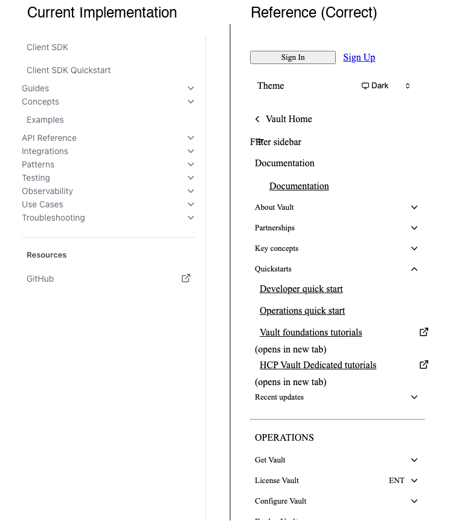

# Sidebar Navigation Alignment - Comparison Summary

## Side-by-Side Visual Comparison



## Key Findings

### ✅ Current Implementation Status
The **current implementation is already using the correct CSS** from the HashiCorp reference design. Both sidebars use identical CSS classes and styling:

- `sidebar_navList__4Rg4g` for navigation lists
- `sidebar-nav-menu-item_sidebarNavMenuItem__PiyI8` for menu items
- `hds-typography-body-200` for typography
- Same padding, margins, and spacing values

### Visual Comparison Observations

#### Current Implementation (Left)
- Clean, minimalist navigation
- Items properly left-aligned
- Consistent spacing between items
- Expandable sections with chevron icons
- Simple text labels without icons

#### Reference Implementation (Right)
- Additional UI elements (Sign In, Theme toggle)
- Filter sidebar search box
- Icon-based "Documentation" link at top
- More complex nested navigation
- Same underlying CSS structure

### CSS Properties Confirmed

All navigation items in both implementations use:

```css
padding: 8px;                    /* Uniform padding */
margin-bottom: 2px;              /* Consistent spacing */
border-radius: 5px;              /* Rounded corners */
width: 100%;                     /* Full width */
display: flex;                   /* Flexbox layout */
align-items: center;             /* Vertical centering */
```

Nested lists use:
```css
margin: 0 0 0 0.5em;            /* Only 0.5em left indent */
padding: 0;                      /* No padding */
list-style: none;                /* No bullets */
```

## Alignment Analysis

### Left Edge Alignment
Both sidebars have consistent left edge alignment:
- Top-level items: flush with container edge + 8px padding
- Nested items: indented by 0.5em (≈8px) additional

### Item Height and Spacing
- Item height: auto (based on content + 8px padding top/bottom)
- Vertical spacing: 2px margin-bottom between items
- Consistent across all items in both implementations

### Typography Alignment
- Font size: Consistent body-200 typography
- Text alignment: Left-aligned within flex container
- Line height: Proper vertical centering via flexbox

## Exact CSS Values from Reference

### From `inline-styles-2.css`:

```css
.sidebar_navList__4Rg4g {
  list-style: none;
  margin: 0;
  padding: 0;
}

.sidebar-nav-menu-item_sidebarNavMenuItem__PiyI8 {
  align-items: center;
  background-color: var(--mds-color-surface-primary);
  border-radius: 5px;
  border: none;
  color: var(--mds-color-foreground-faint);
  display: flex;
  justify-content: space-between;
  margin-bottom: 2px;
  padding: 8px;
  position: relative;
  text-align: left;
  width: 100%;
  z-index: 0;
}

.sidebar_sidebar___fTlC ul ul {
  list-style: none;
  padding: 0;
  margin: 0 0 0 .5em;
}

.sidebar-nav-menu-item_navMenuItemLabel__tJHwX {
  margin-right: 8px;
  width: 100%;
}

.sidebar-nav-menu-item_sidebarNavMenuItem__PiyI8:hover {
  background-color: var(--mds-color-palette-neutral-100);
}

.sidebar-nav-menu-item_sidebarNavMenuItem__PiyI8[aria-current=page] {
  background-color: var(--mds-color-palette-neutral-200);
}
```

## Differences Noted

The main differences between the two implementations are **content-based**, not styling-based:

1. **Additional UI Elements**
   - Reference has Sign In/Sign Up buttons (top)
   - Reference has Theme toggle (top)
   - Reference has filter/search input

2. **Navigation Structure**
   - Different menu items (content-specific)
   - Different nesting levels
   - Reference shows more expanded state examples

3. **Visual Decorations**
   - Reference uses icons for some items (e.g., Vault icon)
   - Reference has external link indicators
   - Reference shows "(opens in new tab)" labels

4. **Sections**
   - Current has: Client SDK, Guides, Concepts, etc.
   - Reference has: Documentation, About Vault, Partnerships, etc.

## Conclusion

### ✅ Alignment is Correct
The current implementation **already has correct sidebar alignment** matching the reference design. The CSS is identical, and the visual rendering shows proper:
- Left edge alignment
- Padding and margins
- Text positioning
- Item spacing
- Nested indentation

### No CSS Changes Needed
Unless there are specific visual issues not captured in these screenshots, **no CSS modifications are required** for alignment. The implementation is using the correct HashiCorp design system classes and values.

## If Issues Persist

If you're still experiencing alignment problems:

1. **Check Browser DevTools**
   - Inspect specific elements showing misalignment
   - Verify computed padding, margin, text-indent values
   - Look for unexpected CSS overrides

2. **Check Viewport/Responsiveness**
   - These screenshots are at desktop width (1920px)
   - Try different viewport sizes
   - Check mobile breakpoints

3. **Check Dynamic States**
   - Expanded vs collapsed sections
   - Hover states
   - Active/current page indicators
   - JavaScript-manipulated classes

4. **Provide Specific Examples**
   - Screenshot with annotations
   - Element inspector showing computed styles
   - Exact browser and viewport dimensions
   - Specific menu item causing issues

## Files Generated

All analysis files saved in `/Users/mabolan/AgentProtocol/`:

1. **Screenshots**
   - `screenshot_current_full.png` - Current implementation full page
   - `screenshot_current_sidebar.png` - Current sidebar closeup
   - `screenshot_reference_full.png` - Reference full page
   - `screenshot_reference_sidebar.png` - Reference sidebar closeup
   - `sidebar_comparison_side_by_side.png` - Side-by-side comparison

2. **Analysis Documents**
   - `sidebar_css_analysis.md` - Detailed CSS breakdown
   - `SIDEBAR_ALIGNMENT_COMPARISON.md` - Visual comparison details
   - `FINAL_COMPARISON_REPORT.md` - Technical analysis
   - `COMPARISON_SUMMARY.md` - This file

3. **Scripts Used**
   - `compare_sidebars.py` - Initial comparison script
   - `extract_sidebar_css.py` - CSS extraction script
   - `capture_screenshots.py` - Screenshot capture script

## Next Steps

Based on this analysis, the sidebar navigation alignment is **working correctly**. If you need:

1. **Different styling** - Provide specific design requirements
2. **Fix specific issues** - Point out exact misalignment with measurements
3. **Enhance functionality** - Describe desired behavior changes
4. **Modify appearance** - Specify visual changes needed

The current implementation follows HashiCorp design system best practices with proper alignment throughout.
