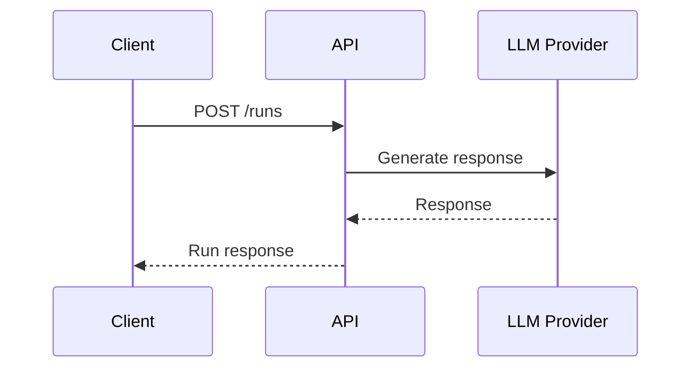
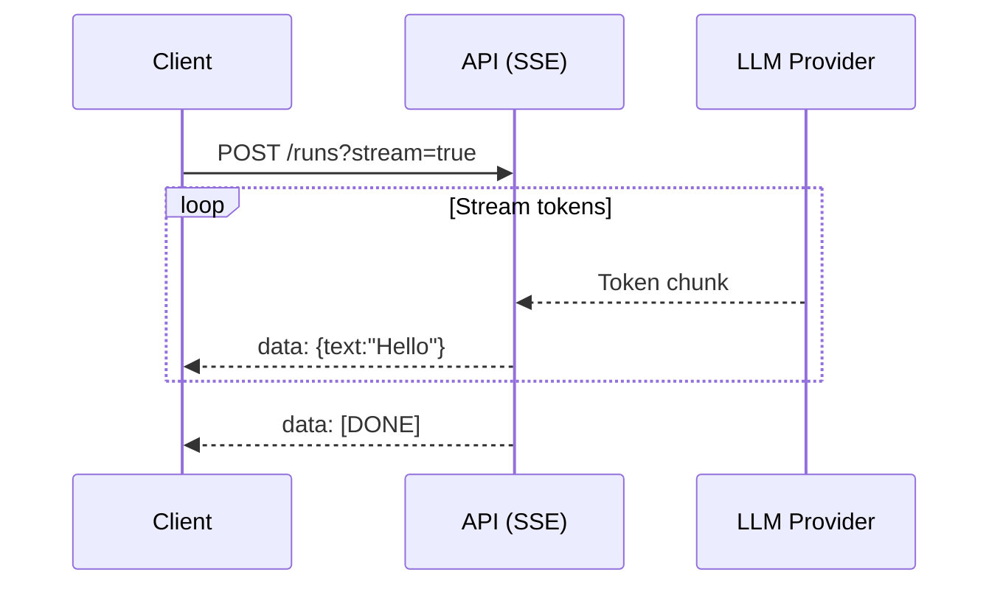

# Getting Started with Agent Protocol

Welcome to the Agent Protocol! This guide will help you go from zero to your first working agent integration.

---

## 🚀 Start Here: 5-Minute Quickstart

New to Agent Protocol? Start with our quickstart guide to make your first API call and see immediate results.

-   :material-speedometer:{ .lg .middle } **5-Minute Quickstart**

    ---

    Send your first message, stream responses, and manage conversation threads.

    **Learn**: Basic request/response • Streaming • Threads

    [:octicons-arrow-right-24: Start Tutorial](quickstart.md)

---

## 📚 Learning Path

Follow this progression to master the Agent Protocol:

### 1. :material-rocket-launch: **Fundamentals** (15 minutes)

Start with the basics - sending messages and receiving responses.

- [**Quickstart Guide**](quickstart.md) - Your first three agent operations
- Focus: `POST /runs`, streaming, conversation threads

### 2. :material-tools: **Tool Execution** (20 minutes)

Learn how agents can call your functions to access data and perform actions.

- [**Tool Execution Guide**](tools.md) - Function calling patterns
- Focus: Weather APIs, databases, calculations, validation

### 3. :material-code-braces: **Practical Examples** (30 minutes)

Copy-paste code patterns for common scenarios.

- [**Code Examples**](examples.md) - Retry logic, batch processing, image analysis
- Focus: Production-ready patterns you can use immediately

### 4. :material-rocket:{ .middle } **Advanced Patterns** (45 minutes)

Master advanced workflows for production applications.

- [**Advanced Patterns**](advanced-patterns.md) - Ephemeral runs, hooks, auto-response
- Focus: Scaling, resilience, multi-agent systems

### 5. :material-bug:{ .middle } **Troubleshooting** (Reference)

Quick solutions to common issues.

- [**Troubleshooting Guide**](troubleshooting.md) - Error solutions and diagnostics
- Focus: 401, 429, stuck runs, tool results, context limits

---

## 🎯 Choose Your Path

Not sure where to start? Pick your goal:

-   :material-chat:{ .lg .middle } **"I want to build a chatbot"**

    ---

    Start with: [Quickstart](quickstart.md) → [Examples](examples.md)

    You'll learn: Basic messaging, streaming responses, conversation history

-   :material-database:{ .lg .middle } **"I need agents to access my data"**

    ---

    Start with: [Quickstart](quickstart.md) → [Tool Execution](tools.md)

    You'll learn: Function calling, database tools, API integrations

-   :material-scale-balance:{ .lg .middle } **"I'm building for production"**

    ---

    Start with: [Advanced Patterns](advanced-patterns.md) → [Troubleshooting](troubleshooting.md)

    You'll learn: Error handling, retries, monitoring, scaling

-   :material-account-multiple:{ .lg .middle } **"I need multiple agents"**

    ---

    Start with: [Advanced Patterns](advanced-patterns.md) → [Multi-Agent Guide](../guides/multi-agent.md)

    You'll learn: Agent handoffs, delegation, supervision

---

## 📖 Complete Guide Structure

All getting started resources:

| Guide | Level | Time | What You'll Learn |
|-------|-------|------|-------------------|
| [**Quickstart**](quickstart.md) | 🟢 Beginner | 5 min | First API calls, streaming, threads |
| [**Tool Execution**](tools.md) | 🟡 Intermediate | 20 min | Function calling, tool patterns |
| [**Code Examples**](examples.md) | 🟡 Intermediate | 30 min | Retry logic, batching, images |
| [**Advanced Patterns**](advanced-patterns.md) | 🔴 Advanced | 45 min | Ephemeral runs, hooks, remote endpoints |
| [**Troubleshooting**](troubleshooting.md) | 🟡 Reference | As needed | Common issues and solutions |

---

## 🎓 Prerequisites

Before you start, ensure you have:

!!! info "What You Need"

    - **API Access**: Agent Runtime API endpoint and credentials
    - **Programming Language**: Examples in Python, JavaScript (adaptable to any language)
    - **HTTP Client**: requests (Python), fetch (JavaScript), or curl
    - **OAuth2 (Optional)**: For Microsoft Graph integration

---

## 🏗️ Architecture Overview

Understanding the flow helps you build better integrations.

### Basic Flow

### Streaming Flow

---

## 🔗 Related Documentation

After getting started, explore these sections:

- **[Integration Guides](../guides/)** - Security, webhooks, multi-agent patterns
- **[API Reference](../api-reference/)** - Complete endpoint documentation
- **[Specifications](../specifications/)** - Behavioral requirements and state machines
- **[Contributing](../contributing.md)** - Help improve the protocol

---

## 💡 Quick Tips

!!! tip "Best Practices"

    - **Start Simple**: Begin with the quickstart, then gradually add complexity
    - **Use Streaming**: Provides better user experience for interactive applications
    - **Handle Errors**: Always implement retry logic with exponential backoff
    - **Test Thoroughly**: Use the [Testing Guide](../guides/testing-agents.md) for production deployments

!!! warning "Common Pitfalls"

    - **Skipping Tool Validation**: Always validate tool inputs and outputs
    - **Ignoring Rate Limits**: Implement backoff strategies from day one
    - **Context Window**: Monitor token usage to avoid context length errors
    - **Missing Error Handling**: Don't assume API calls always succeed

---

## 🆘 Need Help?

- **Stuck?** Check the [Troubleshooting Guide](troubleshooting.md)
- **Questions?** Visit [GitHub Discussions](https://github.com/madsbolaris/AgentProtocol/discussions)
- **Bug Report?** Open an [Issue](https://github.com/madsbolaris/AgentProtocol/issues)
- **Want to Contribute?** See [Contributing Guide](../contributing.md)

---

**Ready to begin?** [:octicons-arrow-right-24: Start the 5-Minute Quickstart](quickstart.md)
