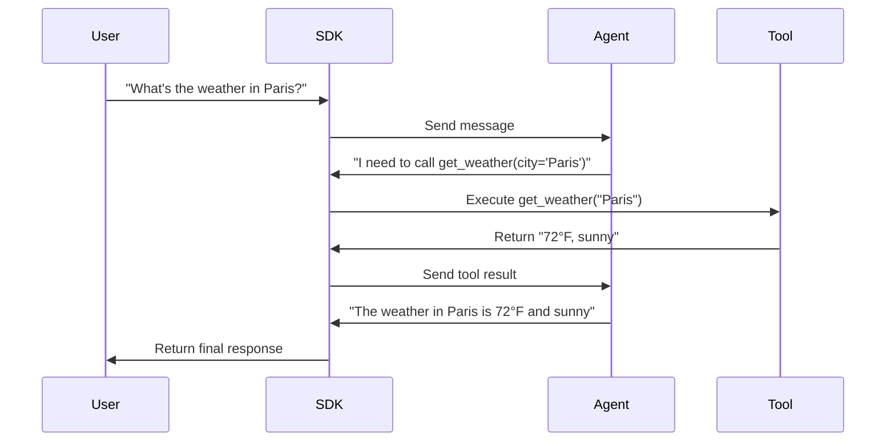

# Tools & Function Calling

Enable agents to call your functions and access external systems.

## Overview

**Tools** (also called "function calling") allow agents to extend their capabilities by calling functions you provide. The agent decides when to call a tool, the SDK executes it automatically, and the result is returned to the agent for incorporation into its response.

---

## How Tools Work



**Key Points:**

- The **agent decides** when to call tools based on the user's request
- The **SDK executes** the tool automatically in your code
- The **agent receives** the result and incorporates it into the response
- The **user sees** only the final, natural language answer

---

## Basic Tool Example

=== "Python"

    ```python
    from microsoft.agents.protocol import AgentProtocolClient, ToolCollection

    client = AgentProtocolClient("http://localhost:5000")

    # Define tools
    tools = ToolCollection()

    @tools.register("get_weather")
    def get_weather(city: str) -> str:
        """Get the current weather for a city."""
        # In production, call a real weather API
        return f"72°F and sunny in {city}"

    # Use tools in a request
    response = await client.complete_chat(
        "What's the weather in San Francisco?",
        tools=tools
    )
    print(response)
    # Output: "The weather in San Francisco is 72°F and sunny!"
    ```

=== "TypeScript"

    ```typescript
    import { AgentProtocolClient, ToolCollection } from '@microsoft/agents-protocol-client';

    const client = new AgentProtocolClient("http://localhost:5000");

    // Define tools
    const tools = new ToolCollection();

    tools.register("get_weather", {
        description: "Get the current weather for a city",
        parameters: {
            city: { type: "string", description: "City name" }
        },
        execute: async (city: string) => {
            return `72°F and sunny in ${city}`;
        }
    });

    // Use tools in a request
    const response = await client.completeChat(
        "What's the weather in San Francisco?",
        { tools }
    );
    console.log(response);
    ```

=== "C#"

    ```csharp
    using Microsoft.Agents.Protocol.Client;

    var client = new AgentProtocolClient("http://localhost:5000");

    // Define tools
    var tools = new ToolCollection
    {
        ["get_weather"] = (string city) =>
        {
            // In production, call a real weather API
            return $"72°F and sunny in {city}";
        }
    };

    // Use tools in a request
    var response = await client.CompleteChatAsync(
        "What's the weather in San Francisco?",
        tools: tools
    );
    Console.WriteLine(response);
    ```

---

## Tool Registration

### Decorator-Based (Python)

```python
tools = ToolCollection()

@tools.register("calculate")
def calculate(expression: str) -> float:
    """Evaluate a mathematical expression."""
    return eval(expression)  # Note: Use safe_eval in production!

@tools.register("search_database")
async def search_database(query: str) -> list[dict]:
    """Search the product database."""
    async with database.connect() as conn:
        results = await conn.fetch(query)
        return [dict(row) for row in results]
```

### Manual Registration (All Languages)

=== "Python"

    ```python
    def get_stock_price(symbol: str) -> float:
        """Get current stock price."""
        return 150.25

    tools = ToolCollection()
    tools.add("get_stock_price", get_stock_price,
              description="Get current stock price for a symbol")
    ```

=== "TypeScript"

    ```typescript
    tools.register("get_stock_price", {
        description: "Get current stock price for a symbol",
        parameters: {
            symbol: { type: "string", description: "Stock ticker symbol" }
        },
        execute: async (symbol: string) => 150.25
    });
    ```

=== "C#"

    ```csharp
    tools.Add("get_stock_price", (string symbol) =>
    {
        // Call stock API
        return 150.25;
    }, "Get current stock price for a symbol");
    ```

---

## Tool Parameters

### Type-Safe Definitions

The SDK uses JSON Schema for parameter definitions:

=== "Python"

    ```python
    @tools.register("create_event")
    def create_event(
        title: str,
        date: str,
        attendees: list[str],
        duration_minutes: int = 60
    ) -> str:
        """
        Create a calendar event.

        Args:
            title: Event title
            date: Event date (ISO 8601)
            attendees: List of attendee emails
            duration_minutes: Event duration (default: 60)
        """
        # Create event
        return f"Created event '{title}' on {date}"
    ```

=== "TypeScript"

    ```typescript
    tools.register("create_event", {
        description: "Create a calendar event",
        parameters: {
            title: {
                type: "string",
                description: "Event title"
            },
            date: {
                type: "string",
                description: "Event date (ISO 8601)"
            },
            attendees: {
                type: "array",
                items: { type: "string" },
                description: "List of attendee emails"
            },
            duration_minutes: {
                type: "integer",
                description: "Event duration",
                default: 60
            }
        },
        execute: async (args) => {
            return `Created event '${args.title}' on ${args.date}`;
        }
    });
    ```

=== "C#"

    ```csharp
    tools.Add("create_event",
        (string title, string date, List<string> attendees, int durationMinutes = 60) =>
        {
            // Create event
            return $"Created event '{title}' on {date}";
        },
        description: "Create a calendar event",
        parameters: new ToolParameters
        {
            ["title"] = new Parameter { Type = "string", Description = "Event title" },
            ["date"] = new Parameter { Type = "string", Description = "Event date (ISO 8601)" },
            ["attendees"] = new Parameter { Type = "array", Items = new { Type = "string" } },
            ["duration_minutes"] = new Parameter { Type = "integer", Default = 60 }
        }
    );
    ```

### Complex Parameters

```python
@tools.register("search_products")
def search_products(
    query: str,
    filters: dict,
    sort_by: str = "relevance",
    limit: int = 10
) -> list[dict]:
    """
    Search products with filters.

    Args:
        query: Search query
        filters: Filter criteria (e.g., {"category": "electronics", "price_max": 100})
        sort_by: Sort order (relevance, price, rating)
        limit: Maximum results
    """
    # Search implementation
    return [
        {"id": 1, "name": "Product A", "price": 49.99},
        {"id": 2, "name": "Product B", "price": 79.99}
    ]
```

---

## Multiple Tools

Agents can use multiple tools in a single request:

```python
tools = ToolCollection()

@tools.register("get_weather")
def get_weather(city: str) -> str:
    return "72°F, sunny"

@tools.register("get_traffic")
def get_traffic(city: str) -> str:
    return "Light traffic, 15 min delay"

@tools.register("find_restaurants")
def find_restaurants(city: str, cuisine: str) -> list[str]:
    return ["Restaurant A", "Restaurant B", "Restaurant C"]

# Agent will call multiple tools as needed
response = await client.complete_chat(
    "I'm visiting Paris. What's the weather, traffic, and can you recommend Italian restaurants?",
    tools=tools
)
# Agent calls: get_weather("Paris"), get_traffic("Paris"), find_restaurants("Paris", "Italian")
```

---

## Tool Results

### Simple Results

Return strings, numbers, booleans, or None:

```python
@tools.register("check_inventory")
def check_inventory(product_id: str) -> int:
    return 42  # Items in stock

@tools.register("is_available")
def is_available(product_id: str) -> bool:
    return True

@tools.register("get_description")
def get_description(product_id: str) -> str:
    return "High-quality product"
```

### Structured Results

Return dicts or lists for complex data:

```python
@tools.register("get_user_profile")
def get_user_profile(user_id: str) -> dict:
    return {
        "id": user_id,
        "name": "Alice",
        "email": "alice@example.com",
        "preferences": {
            "theme": "dark",
            "notifications": True
        }
    }

@tools.register("list_orders")
def list_orders(user_id: str) -> list[dict]:
    return [
        {"order_id": "123", "total": 49.99, "status": "shipped"},
        {"order_id": "124", "total": 29.99, "status": "delivered"}
    ]
```

### Error Results

Return error messages as strings or raise exceptions:

```python
@tools.register("charge_card")
def charge_card(amount: float, card_token: str) -> str:
    if amount > 1000:
        raise ValueError("Amount exceeds limit")

    # Process payment
    return f"Charged ${amount:.2f} successfully"
```

The agent will see: "Error: Amount exceeds limit" and can respond appropriately.

---

## Async Tools

All tool functions can be async:

=== "Python"

    ```python
    @tools.register("fetch_data")
    async def fetch_data(url: str) -> dict:
        async with httpx.AsyncClient() as client:
            response = await client.get(url)
            return response.json()

    @tools.register("query_database")
    async def query_database(sql: str) -> list[dict]:
        async with database.connect() as conn:
            results = await conn.fetch(sql)
            return [dict(row) for row in results]
    ```

=== "TypeScript"

    ```typescript
    tools.register("fetch_data", {
        description: "Fetch data from a URL",
        parameters: { url: { type: "string" } },
        execute: async (url: string) => {
            const response = await fetch(url);
            return await response.json();
        }
    });
    ```

=== "C#"

    ```csharp
    tools.Add("fetch_data", async (string url) =>
    {
        using var client = new HttpClient();
        var response = await client.GetAsync(url);
        var data = await response.Content.ReadAsStringAsync();
        return JsonSerializer.Deserialize<object>(data);
    });
    ```

---

## Tool Choice Control

Control when the agent uses tools:

=== "Python"

    ```python
    # Auto (default) - Agent decides
    response = await client.complete_chat(message, tools=tools)

    # Force tool use - Agent must call at least one tool
    response = await client.complete_chat(
        message,
        tools=tools,
        tool_choice="required"
    )

    # Disable tools - Agent cannot call any tools
    response = await client.complete_chat(
        message,
        tools=tools,
        tool_choice="none"
    )

    # Force specific tool - Agent must call this specific tool
    response = await client.complete_chat(
        message,
        tools=tools,
        tool_choice={"type": "function", "function": {"name": "get_weather"}}
    )
    ```

=== "TypeScript"

    ```typescript
    // Auto (default) - Agent decides
    const response = await client.completeChat(message, { tools });

    // Force tool use
    const response = await client.completeChat(message, {
        tools,
        toolChoice: "required"
    });

    // Force specific tool
    const response = await client.completeChat(message, {
        tools,
        toolChoice: { type: "function", function: { name: "get_weather" } }
    });
    ```

=== "C#"

    ```csharp
    // Auto (default)
    var response = await client.CompleteChatAsync(message, tools: tools);

    // Force tool use
    var response = await client.CompleteChatAsync(
        message,
        tools: tools,
        toolChoice: ToolChoice.Required
    );

    // Force specific tool
    var response = await client.CompleteChatAsync(
        message,
        tools: tools,
        toolChoice: new ToolChoice("get_weather")
    );
    ```

---

## Tool Streaming

Stream tool calls and results:

```python
async def on_tool_call(name: str, arguments: dict):
    print(f"\n🔧 Calling {name} with {arguments}")

async def on_tool_result(name: str, result: str):
    print(f"✅ {name} returned: {result}")

await client.stream_chat(
    "What's the weather and traffic in Tokyo?",
    tools=tools,
    on_text_chunk=lambda t: print(t, end=""),
    on_function_call=on_tool_call,
    on_function_result=on_tool_result
)
```

**Output:**
```
🔧 Calling get_weather with {'city': 'Tokyo'}
✅ get_weather returned: 68°F, cloudy
🔧 Calling get_traffic with {'city': 'Tokyo'}
✅ get_traffic returned: Moderate traffic
The weather in Tokyo is 68°F and cloudy, with moderate traffic conditions.
```

---

## Best Practices

1. **Clear Descriptions**
   - Provide detailed docstrings/descriptions for each tool
   - The agent uses these to decide when to call the tool

   ```python
   @tools.register("send_email")
   def send_email(to: str, subject: str, body: str) -> str:
       """
       Send an email to a recipient.

       Use this tool when the user wants to send an email or message someone.

       Args:
           to: Recipient email address
           subject: Email subject line
           body: Email body content
       """
   ```

2. **Validate Inputs**
   ```python
   @tools.register("transfer_money")
   def transfer_money(from_account: str, to_account: str, amount: float) -> str:
       if amount <= 0:
           raise ValueError("Amount must be positive")
       if amount > 10000:
           raise ValueError("Amount exceeds daily limit")
       # Process transfer
   ```

3. **Return Useful Results**
   - Include relevant details the agent needs to respond
   - Format as human-readable when possible

   ```python
   @tools.register("book_flight")
   def book_flight(origin: str, destination: str, date: str) -> str:
       # Instead of just: return "OK"
       return f"Booked flight from {origin} to {destination} on {date}. Confirmation: ABC123. Total: $450."
   ```

4. **Handle Errors Gracefully**
   ```python
   @tools.register("api_call")
   def api_call(endpoint: str) -> dict:
       try:
           response = requests.get(endpoint)
           response.raise_for_status()
           return response.json()
       except requests.RequestException as e:
           return {"error": str(e)}
   ```

5. **Keep Tools Focused**
   - One tool = one responsibility
   - Break complex operations into multiple tools

   ```python
   # Instead of one "manage_calendar" tool:
   @tools.register("create_event")
   def create_event(...): pass

   @tools.register("update_event")
   def update_event(...): pass

   @tools.register("delete_event")
   def delete_event(...): pass

   @tools.register("list_events")
   def list_events(...): pass
   ```

---

## Next Steps

<div class="grid cards" markdown>

- **:material-transit-connection-variant: Streaming**

    Stream tool calls and results

    [:octicons-arrow-right-24: Learn Streaming](streaming.md)

- **:material-alert-circle: Error Handling**

    Handle tool errors

    [:octicons-arrow-right-24: Error Handling](error-handling.md)

- **:material-book-open: How-To: Use Tools**

    Practical tool patterns

    [:octicons-arrow-right-24: How-To Guide](../guides/use-tools.md)

</div>
