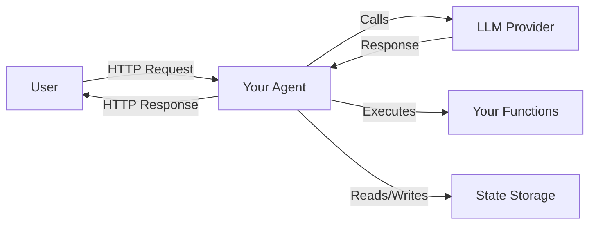

# Hosting SDK Quickstart

**Build your first AI agent server in 15 minutes**

This guide walks you through building agent servers from simple examples to production-ready deployments. By the end, you'll have a working agent that responds intelligently, calls functions, and manages state.

---

## What You'll Build

You'll create an **agent server** that:

- Receives messages from users via HTTP
- Uses an LLM (like GPT-4) to generate responses
- Can call custom functions to fetch real-time data
- Maintains conversation state across messages
- Is production-ready with security and observability



!!! note "Agent vs Client"
    - **Hosting SDK** (this guide): Build agent servers
    - **Client SDK**: Connect to existing agents

    They work together: Host builds the server, Client consumes it.

---

## Prerequisites

- **Language**: Python 3.10+, Node.js 18+, or .NET 8+
- **LLM Access**: API key from OpenAI, Anthropic, or Azure OpenAI
- **Knowledge**: Basic async/await understanding (we'll guide you through)

---

## Step 1: Get an API Key

Choose your LLM provider and get an API key:

- **OpenAI**: [platform.openai.com/api-keys](https://platform.openai.com/api-keys)
- **Anthropic**: [console.anthropic.com](https://console.anthropic.com)
- **Azure OpenAI**: [Azure Portal](https://portal.azure.com)

---

## Step 2: Environment Setup

=== "Python"

    ```bash
    # Create project folder
    mkdir my-agent && cd my-agent

    # Create .env file
    cat > .env << EOF
    OPENAI_API_KEY=sk-your-key-here
    OPENAI_API_BASE=https://api.openai.com/v1  # Optional: override for Azure
    LOG_LEVEL=INFO
    EOF

    # Install SDK
    pip install microsoft-agents-hosting python-dotenv
    ```

    **Project structure:**
    ```
    my-agent/
    ├── agent.py          # Your agent code
    ├── .env             # API keys (DON'T commit!)
    ├── requirements.txt # Dependencies
    └── .gitignore       # Ignore .env
    ```

=== "TypeScript"

    ```bash
    # Create project
    mkdir my-agent && cd my-agent
    npm init -y

    # Create .env file
    cat > .env << EOF
    OPENAI_API_KEY=sk-your-key-here
    OPENAI_API_BASE=https://api.openai.com/v1
    LOG_LEVEL=INFO
    EOF

    # Install SDK
    npm install @microsoft/agents-hosting dotenv
    npm install -D typescript @types/node tsx

    # Create tsconfig.json
    npx tsc --init --target ES2022 --module NodeNext --strict
    ```

    Update `package.json`:
    ```json
    {
      "type": "module",
      "scripts": {
        "start": "tsx src/agent.ts"
      }
    }
    ```

=== "C#"

    ```bash
    # Create project
    dotnet new web -n MyAgent
    cd MyAgent

    # Install SDK
    dotnet add package Microsoft.Agents.Protocol.Hosting
    dotnet add package DotNetEnv

    # Create .env file
    cat > .env << EOF
    OPENAI_API_KEY=sk-your-key-here
    LOG_LEVEL=Information
    EOF
    ```

    Add to `.gitignore`:
    ```
    .env
    appsettings.Development.json
    ```

!!! warning "Security: Protect Your API Keys"
    **NEVER commit API keys to version control!**

    - Use `.env` files (add to `.gitignore`)
    - In production: Use Azure Key Vault, AWS Secrets Manager, or similar
    - Rotate keys regularly

---

## Step 3: Install

=== "Python"
    ```bash
    pip install microsoft-agents-hosting
    ```

=== "TypeScript"
    ```bash
    npm install @microsoft/agents-hosting
    ```

=== "C#"
    ```bash
    dotnet add package Microsoft.Agents.Protocol.Hosting
    ```

---

## Your First Agent (3 minutes)

### Simple Echo Agent

=== "Python"

    ```python
    # agent.py
    from typing import Optional
    from datetime import datetime, timezone
    from microsoft.agents.hosting import (
        AgentHostBuilder,
        TurnResult,
        Message,
        MessageContext,
        CancellationToken,
    )
    import os
    from dotenv import load_dotenv

    load_dotenv()  # Load .env file

    async def on_user_message(
        message: Message,
        context: MessageContext,
        ct: CancellationToken
    ) -> TurnResult:
        """Echo the user's message back."""
        text = message.text or ""
        await context.respond_async(f"You said: {text}")
        return TurnResult.REPLIED

    agent_host = (
        AgentHostBuilder()
        .add_default_agent(lambda agent: agent
            .use_llm(
                model=os.getenv("OPENAI_MODEL", "gpt-4o"),
                instructions="You are a helpful assistant.",
                api_key=os.getenv("OPENAI_API_KEY"),
            )
            .on_user_message(on_user_message)
        )
        .build()
    )

    if __name__ == "__main__":
        agent_host.run()
    ```

=== "TypeScript"

    ```typescript
    // src/agent.ts
    import { AgentHostBuilder, TurnResult, type Message, type MessageContext, type CancellationToken } from '@microsoft/agents-hosting';
    import { config } from 'dotenv';

    config();  // Load .env file

    const agentHost = new AgentHostBuilder()
      .addDefaultAgent(agent => agent
        .useLLM(
          process.env.OPENAI_MODEL ?? 'gpt-4o',
          'You are a helpful assistant.',
          {
            apiKey: process.env.OPENAI_API_KEY,
            apiBase: process.env.OPENAI_API_BASE,
          }
        )
        .onUserMessage(async (
          message: Message,
          context: MessageContext,
          ct: CancellationToken
        ): Promise<TurnResult> => {
          const text = message.text ?? '';
          await context.respondAsync(`You said: ${text}`);
          return TurnResult.REPLIED;
        })
      )
      .build();

    await agentHost.run();
    ```

=== "C#"

    ```csharp
    // Program.cs
    using Microsoft.Agents.Hosting;
    using Microsoft.Agents.Storage;
    using DotNetEnv;

    // Load .env file
    Env.Load();

    var builder = WebApplication.CreateBuilder(args);
    builder.AddAgent<EchoAgent>();
    builder.Services.AddSingleton<IStorage, MemoryStorage>();

    var app = builder.Build();
    app.MapAgentProtocol();
    await app.RunAsync();

    public class EchoAgent : AgentBase
    {
        public EchoAgent()
        {
            Instructions = "You are a helpful assistant.";
            Model = Environment.GetEnvironmentVariable("OPENAI_MODEL") ?? "gpt-4o";
        }

        public override async Task OnUserMessage(
            IMessageContext context,
            CancellationToken cancellationToken = default)
        {
            ArgumentNullException.ThrowIfNull(context);

            var messageText = context.Message?.Text ?? string.Empty;
            await context.RespondAsync(
                $"You said: {messageText}",
                cancellationToken
            );
        }
    }
    ```

**Run it:**

=== "Python"
    ```bash
    python agent.py
    ```

=== "TypeScript"
    ```bash
    npm start
    ```

=== "C#"
    ```bash
    dotnet run
    ```

**Test it:**

```bash
curl -X POST http://localhost:5000/threads \
  -H "Content-Type: application/json" \
  -d '{
    "messages": [{
      "role": "user",
      "content": {"text": "Hello!"}
    }]
  }'
```

**Expected output:**
```json
{
  "messages": [
    {
      "role": "agent",
      "content": {"text": "You said: Hello!"}
    }
  ]
}
```

!!! tip "Understanding TurnResult"
    Handlers return `TurnResult` to control flow:

    - `CONTINUE`: Pass to next handler or LLM
    - `REPLIED`: You sent a response, stop processing
    - `CONSUMED`: Don't respond, just stop

---

## Add Function Calling

Let your agent call custom functions to fetch real-time data.

=== "Python"

    ```python
    from datetime import datetime, timezone

    def get_time() -> str:
        """Get current UTC time."""
        return datetime.now(timezone.utc).isoformat()

    def get_weather(city: str, country: str = "US") -> str:
        """Get weather for a city (mock - use real API in production)."""
        # Input validation
        if not city or len(city) > 100:
            return "Error: Invalid city name"

        # TODO: Call real weather API
        return f"Weather in {city}, {country}: 72°F and sunny"

    agent_host = (
        AgentHostBuilder()
        .add_default_agent(lambda agent: agent
            .use_llm(
                model="gpt-4o",
                instructions="You are a weather assistant. Use get_weather for current conditions.",
                api_key=os.getenv("OPENAI_API_KEY"),
            )
            .add_functions(lambda f: f
                .add("get_time@v1", "Get current time", get_time)
                .add("get_weather@v1", "Get weather", get_weather)
            )
        )
        .build()
    )
    ```

=== "TypeScript"

    ```typescript
    function getTime(): string {
      return new Date().toISOString();
    }

    function getWeather(city: string, country: string = 'US'): string {
      // Input validation
      if (!city || city.length > 100) {
        return 'Error: Invalid city name';
      }

      // TODO: Call real weather API
      return `Weather in ${city}, ${country}: 72°F and sunny`;
    }

    const agentHost = new AgentHostBuilder()
      .addDefaultAgent(agent => agent
        .useLLM(
          'gpt-4o',
          'You are a weather assistant.',
          { apiKey: process.env.OPENAI_API_KEY }
        )
        .addFunctions(f => f
          .add('get_time@v1', 'Get current time', getTime)
          .add('get_weather@v1', 'Get weather', getWeather)
        )
      )
      .build();
    ```

=== "C#"

    ```csharp
    public class WeatherAgent : AgentBase
    {
        public WeatherAgent()
        {
            Instructions = "You are a weather assistant.";
            Model = "gpt-4o";
        }

        [Tool(Description = "Get current time")]
        public string GetTime()
        {
            return DateTime.UtcNow.ToString("o", CultureInfo.InvariantCulture);
        }

        [Tool(Description = "Get weather")]
        public string GetWeather(string city, string country = "US")
        {
            // Input validation
            if (string.IsNullOrWhiteSpace(city) || city.Length > 100)
                return "Error: Invalid city name";

            // TODO: Call real weather API
            return $"Weather in {city}, {country}: 72°F and sunny";
        }
    }
    ```

!!! warning "Production API Calls"
    Examples use mock data. In production:

    - Call real APIs (OpenWeatherMap, Weather.gov)
    - Add error handling for API failures
    - Implement caching to avoid rate limits
    - Use async operations for I/O

---

## State Management

Track conversation data across messages.

=== "Python"

    ```python
    async def on_user_message(
        message: Message,
        context: MessageContext,
        ct: CancellationToken
    ) -> TurnResult:
        # Get state (persists across messages)
        count: int = await context.state.get_async("message_count", default=0)

        # Update state
        await context.state.set_async("message_count", count + 1)
        await context.state.set_async("last_message", message.text)
        await context.state.set_async(
            "last_seen",
            datetime.now(timezone.utc).isoformat()
        )

        # Add context for LLM
        if count == 0:
            context.add_context("This is the user's first message.")

        return TurnResult.CONTINUE  # Let LLM respond
    ```

=== "TypeScript"

    ```typescript
    .onUserMessage(async (message, context, ct) => {
      // Get state with type safety
      const count = await context.state.getAsync<number>('message_count') ?? 0;

      // Update state
      await context.state.setAsync('message_count', count + 1);
      await context.state.setAsync('last_message', message.text ?? '');
      await context.state.setAsync('last_seen', new Date().toISOString());

      // Add context for LLM
      if (count === 0) {
        context.addContext("This is the user's first message.");
      }

      return TurnResult.CONTINUE;
    })
    ```

=== "C#"

    ```csharp
    public override async Task OnUserMessage(
        IMessageContext context,
        CancellationToken cancellationToken = default)
    {
        // Get state
        var count = await context.State.GetAsync<int>("message_count", cancellationToken) ?? 0;

        // Update state
        await context.State.SetAsync("message_count", count + 1, cancellationToken);
        await context.State.SetAsync("last_message", context.Message?.Text, cancellationToken);
        await context.State.SetAsync("last_seen", DateTime.UtcNow, cancellationToken);

        // Add context for LLM
        if (count == 0)
        {
            context.AddContext("This is the user's first message.");
        }
    }
    ```

!!! info "Storage Backends"
    - **MemoryStorage**: Development only (data lost on restart)
    - **SqlStorage**: Production (PostgreSQL, SQL Server, MySQL)
    - **RedisStorage**: Production (fast, distributed)

    See [Production Deployment](#production-deployment) below.

---

## Production Deployment

### Use Production Storage

=== "Python"

    ```python
    from microsoft.agents.hosting.state import SqlStateStore

    agent_host = (
        AgentHostBuilder()
        .use_state_store(SqlStateStore(
            connection_string=os.getenv("DATABASE_URL"),
            table_name="agent_state"
        ))
        .use_production_defaults()  # Enables retries, logging, etc.
        .add_default_agent(...)
        .build()
    )
    ```

=== "C#"

    ```csharp
    builder.Services.AddSingleton<IStorage>(sp =>
    {
        var connectionString = builder.Configuration.GetConnectionString("AgentDb");
        return new SqlStorage(connectionString);
    });
    ```

### Add Health Checks

=== "C#"

    ```csharp
    builder.Services.AddHealthChecks()
        .AddCheck<StorageHealthCheck>("storage")
        .AddCheck<LLMHealthCheck>("llm");

    var app = builder.Build();

    app.MapHealthChecks("/health/live");  // Kubernetes liveness
    app.MapHealthChecks("/health/ready"); // Kubernetes readiness
    app.MapAgentProtocol();
    ```

---

## Security Best Practices

!!! danger "Critical Security Requirements"

    **1. NEVER hardcode secrets**
    ```python
    # ❌ NEVER DO THIS
    api_key = "sk-1234..."  # Hardcoded!

    # ✅ DO THIS
    api_key = os.getenv("OPENAI_API_KEY")
    if not api_key:
        raise ValueError("API key required")
    ```

    **2. NEVER use eval() or exec()**
    ```python
    # ❌ NEVER DO THIS
    result = eval(user_input)  # REMOTE CODE EXECUTION!

    # ✅ DO THIS (safe AST parsing)
    import ast
    result = safe_eval_math(user_input)  # See docs
    ```

    **3. ALWAYS validate inputs**
    ```python
    # ❌ NEVER DO THIS
    query = f"SELECT * FROM users WHERE name = '{user_input}'"  # SQL INJECTION!

    # ✅ DO THIS
    if not is_valid_city(city):
        return "Error: Invalid input"
    ```

    **4. Use HTTPS in production**
    - Never use HTTP for production APIs
    - Use TLS 1.2 or higher
    - Validate certificates

---

## Troubleshooting

### Agent Won't Start

**Error**: `ModuleNotFoundError: No module named 'microsoft.agents.hosting'`

**Fix**: Install the SDK
```bash
pip install microsoft-agents-hosting
```

---

**Error**: `Port 5000 already in use`

**Fix**: Change the port
```python
agent_host.run(port=5001)
```

---

### Authentication Errors

**Error**: `OpenAI API key not found` or `401 Unauthorized`

**Fix**: Set environment variable
```bash
export OPENAI_API_KEY="sk-your-key-here"
# Or add to .env file
```

---

### Function Not Called

**Problem**: LLM doesn't call your function

**Fix**: Update instructions to mention the function
```python
instructions="You are a weather assistant. Use get_weather to get current conditions."
```

---

## Next Steps

<div class="grid cards" markdown>

- **:material-brain: Core Concepts**

    Understand runs, threads, events, and TurnResult

    [:octicons-arrow-right-24: Learn Concepts](../../concepts/)

- **:material-book-open: How-To Guides**

    Multi-agent systems, hooks, production patterns

    [:octicons-arrow-right-24: How-To Guides](how-to/)

- **:material-shield-lock: Security Guide**

    Input validation, sandboxing, secrets management

    [:octicons-arrow-right-24: Security Best Practices](how-to/security/)

- **:material-cloud-upload: Deployment**

    Azure, AWS, Kubernetes deployment guides

    [:octicons-arrow-right-24: Deploy to Production](how-to/deployment/)

</div>

---

## API Quick Reference

### Agent Creation
```python
AgentHostBuilder()
    .add_default_agent(lambda agent: agent.use_llm(...))
    .build()
```

### Functions
```python
.add_functions(lambda f: f
    .add("name@v1", "description", function)
    .add("name@v2", "description", function, timeout=10.0)
)
```

### State
```python
value = await context.state.get_async("key", default=0)
await context.state.set_async("key", value)
await context.state.clear_async()
```

### TurnResult
```python
TurnResult.CONTINUE  # Pass to next handler/LLM
TurnResult.CONSUMED  # Stop, no response
TurnResult.REPLIED   # Response sent, stop
```

---

**Questions?** Check the [FAQ](../../community/#faq) or [open a discussion](https://github.com/microsoft/AgentProtocol/discussions).
