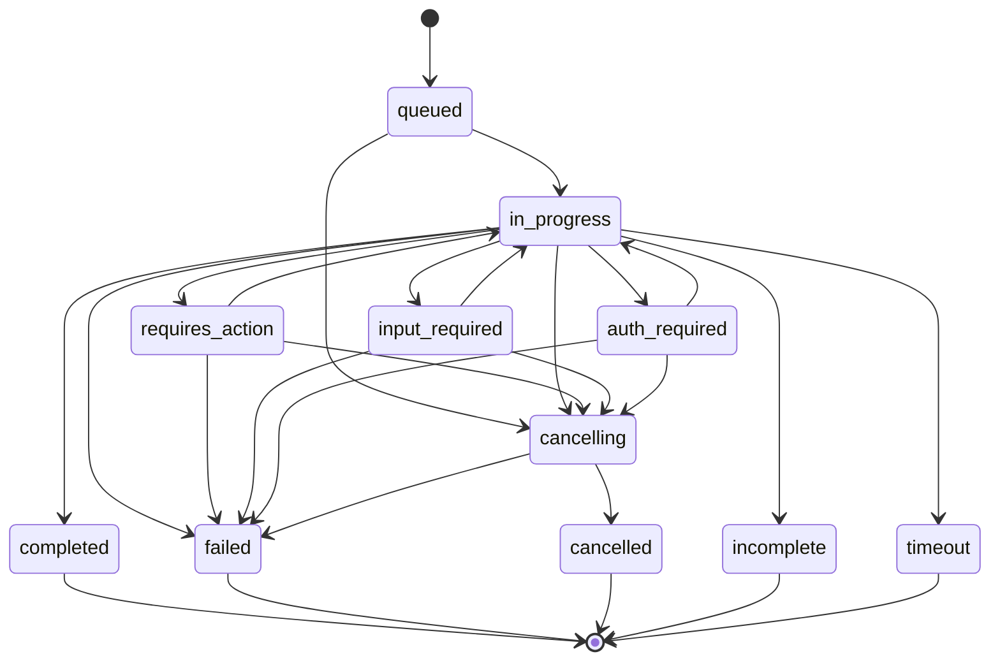
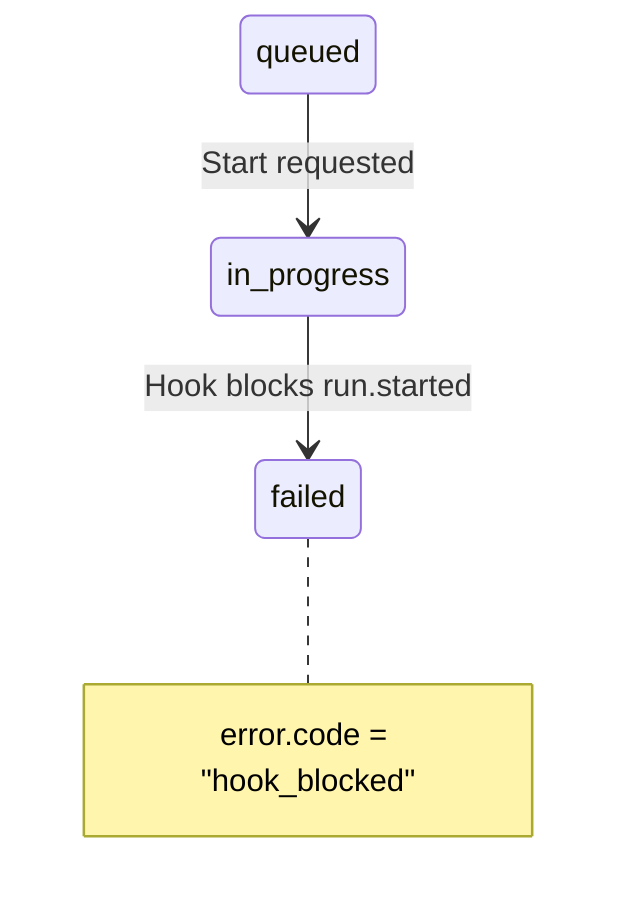
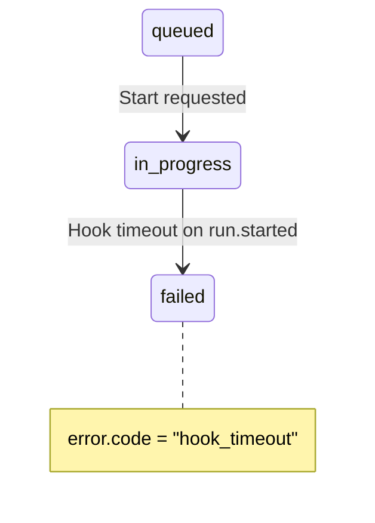
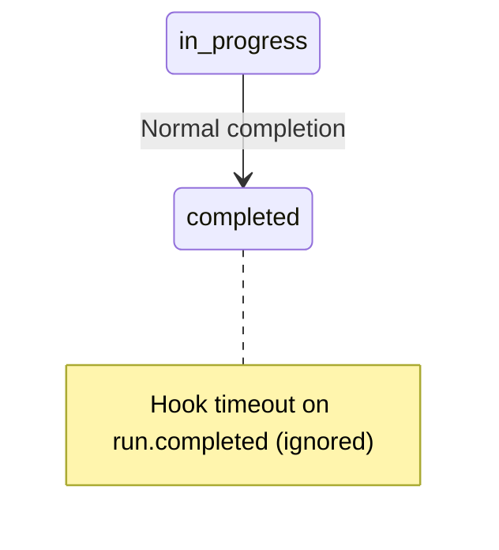

# Run Lifecycle Specification

**Version**: 1.0

## Overview

This specification defines the Run lifecycle state machine, state transitions, cancellation behavior, and execution semantics for the Agent Runtime API.

**Key Concepts:**
- **Run**: Single agent execution instance (like a "run" of a program)
- **Thread**: Conversation containing multiple runs (like a chat history)
- **State Machine**: 11-state lifecycle with well-defined transitions
- **Cancellation**: User-initiated run termination

## Run Model Fields

### Core Identifiers

The Run model includes several key identifiers and optional fields for integration with external systems:

#### journalId Field

**TypeSpec Definition** (See `Run` model in `typespec/execution.tsp`):

```typescript
journalId?: string;  // Optional identifier for agent's journal
```

**Purpose**: Links run to the M365 Agent Journal for cross-conversation memory.

**Overview:**

The `journalId` field enables agents to maintain memory across multiple conversations and threads. Unlike `threadId` (which represents a single conversation) or `sessionId` (which represents a multi-conversation session), `journalId` connects to the Agent Journal - a persistent memory substrate that spans all of an agent's interactions.

**Key Characteristics:**

- **Optional Field**: Not required for stateless runs
- **Cross-Conversation Memory**: Enables agents to reference past interactions across different threads
- **M365 Integration**: Maps to Agent Journal in M365 Agent Platform
- **Knowledge Substrate**: Stores agent knowledge, learned preferences, user context
- **Long-Term Memory**: Persists beyond individual conversations

**Use Cases:**

1. **Personal Assistant Agents**:

```json
POST /runs
{
  "agentId": "personal_assistant_001",
  "threadId": "thread_456",
  "journalId": "journal_user_123",
  "input": [{ "role": "user", "contents": [{ "kind": "text", "text": "What did we discuss last week?" }] }]
}
```

- Agent accesses journal to recall previous conversations
- Provides continuity across thread boundaries

2. **Customer Support Agents**:

```json
POST /runs
{
  "agentId": "support_agent_001",
  "threadId": "thread_support_789",
  "journalId": "journal_customer_456",
  "input": [{ "role": "user", "contents": [{ "kind": "text", "text": "I'm having the same issue again" }] }]
}
```

- Agent retrieves past support interactions from journal
- References previous issues, solutions, preferences

3. **Learning Agents**:

```json
POST /runs
{
  "agentId": "tutor_agent_001",
  "threadId": "thread_lesson_5",
  "journalId": "journal_student_789",
  "input": [{ "role": "user", "contents": [{ "kind": "text", "text": "Can you help with calculus?" }] }]
}
```

- Agent accesses student's learning history
- Adapts teaching based on past performance

**Stateless Runs Without Journal**:

```json
POST /runs
{
  "agentId": "calculator_agent",
  "input": [{ "role": "user", "contents": [{ "kind": "text", "text": "What is 2+2?" }] }],
  "threadCleanup": "delete"
}
```

- No `journalId` provided
- Ephemeral execution without memory
- Suitable for stateless operations

**Relationship to Other IDs:**

| Field | Scope | Lifetime | Purpose |
|-------|-------|----------|---------|
| `runId` | Single execution | One run | Track single agent invocation |
| `threadId` | Single conversation | Multiple runs | Track conversation thread |
| `sessionId` | Multi-conversation | Multiple threads | Track user session |
| `journalId` | Cross-conversation | Permanent | Long-term agent memory |

**M365 Agent Platform Integration:**

- Agent Journal stores knowledge graphs, preferences, context
- Enables agents to build long-term relationships with users
- Supports personalization and context-aware responses
- Provides memory substrate for agent learning

#### webhook Field

**TypeSpec Definition** (See `Run` model in `typespec/execution.tsp`):

```typescript
webhook?: url;  // Optional webhook URL for completion notifications
```

**Purpose**: Server POSTs to webhook URL when run completes, providing alternative to polling for async operations.

**Overview:**

The `webhook` field enables event-driven notification of run completion. Instead of polling `GET /runs/{runId}` repeatedly, clients provide a webhook URL that receives a POST request when the run finishes.

**Key Characteristics:**

- **Optional Field**: Only for async notification pattern
- **POST on Completion**: Server POSTs to URL when run reaches final state
- **Final States**: Triggered on `completed`, `failed`, `cancelled`, `incomplete`, `timeout`
- **Payload Includes**: Run status, output messages, error details
- **Alternative to Polling**: More efficient than repeated GET requests
- **Serverless-Friendly**: Integrates with serverless architectures

**Use Cases:**

1. **Background Processing**:

```json
POST /runs
{
  "agentId": "report_generator_001",
  "threadId": "thread_123",
  "input": [{ "role": "user", "contents": [{ "kind": "text", "text": "Generate quarterly report" }] }],
  "webhook": "https://example.com/webhook/run-complete"
}

// Server responds immediately with run in "queued" state
Response:
{
  "runId": "run_abc123",
  "status": "queued",
  "createdAt": "2026-02-07T10:00:00Z"
}

// Later, when run completes, server POSTs to webhook:
POST https://example.com/webhook/run-complete
{
  "runId": "run_abc123",
  "status": "completed",
  "output": [
    { "role": "assistant", "contents": [{ "kind": "text", "text": "Report generated successfully" }] }
  ],
  "completedAt": "2026-02-07T10:05:00Z"
}
```

2. **Long-Running Tasks**:

```json
POST /runs
{
  "agentId": "data_analysis_agent",
  "threadId": "thread_456",
  "input": [{ "role": "user", "contents": [{ "kind": "text", "text": "Analyze 1M records" }] }],
  "webhook": "https://example.com/webhook/analysis-complete"
}
```

- Avoid long polling for tasks that take minutes/hours
- Get notified immediately when analysis completes

3. **Serverless Architectures**:

```json
POST /runs
{
  "agentId": "lambda_agent_001",
  "input": [{ "role": "user", "contents": [{ "kind": "text", "text": "Process batch" }] }],
  "webhook": "https://api.example.com/lambda/process-result",
  "threadCleanup": "delete"
}
```

- Webhook triggers next Lambda function
- Chain serverless operations without polling

4. **Workflow Orchestration**:

```json
POST /runs
{
  "agentId": "step_1_agent",
  "input": [{ "role": "user", "contents": [{ "kind": "text", "text": "Start workflow" }] }],
  "webhook": "https://workflow.example.com/step-complete"
}
```

- Webhook advances workflow to next step
- Enables step-by-step agent orchestration

**Webhook Payload:**

Server POSTs JSON payload to webhook URL:

```json
POST <webhook_url>
Content-Type: application/json

{
  "runId": "run_abc123",
  "status": "completed",
  "threadId": "thread_123",
  "agentId": "agent_001",
  "output": [
    { "role": "assistant", "contents": [...] }
  ],
  "usage": {
    "promptTokens": 150,
    "completionTokens": 200,
    "totalTokens": 350
  },
  "createdAt": "2026-02-07T10:00:00Z",
  "completedAt": "2026-02-07T10:02:30Z"
}
```

**Webhook Delivery:**

- **Retry Logic**: Server retries on failure (exponential backoff)
- **Timeout**: Webhook request timeout (default 30s)
- **Authentication**: Client can validate webhook signature (implementation-specific)
- **Idempotency**: Include `runId` for deduplication

**Alternative to Polling:**

Without webhook (polling pattern):

```typescript
// Create run
const run = await POST('/runs', { agentId: "...", input: [...] });

// Poll until complete
while (run.status === "queued" || run.status === "in_progress") {
  await sleep(1000);
  run = await GET(`/runs/${run.runId}`);
}

// Process result
console.log(run.output);
```

With webhook (event-driven pattern):

```typescript
// Create run with webhook
await POST('/runs', {
  agentId: "...",
  input: [...],
  webhook: "https://example.com/webhook"
});

// Server notifies when complete (no polling needed)
```

**Benefits:**

- **Reduced Latency**: Immediate notification vs. polling interval delay
- **Lower Server Load**: No repeated GET requests
- **Scalability**: Efficient for high-volume async operations
- **Real-Time**: Event-driven architecture

**Error Handling:**

If webhook delivery fails after retries:

```json
GET /runs/run_abc123

Response:
{
  "runId": "run_abc123",
  "status": "completed",
  "output": [...],
  "webhookDeliveryFailed": true,
  "webhookError": "Connection timeout after 3 retries"
}
```

- Run completes normally even if webhook fails
- Client can still retrieve result via GET /runs/{runId}

## Run States

### State Enum

**TypeSpec Definition** (See `RunStatus` enum in `typespec/execution.tsp`):

```typescript
enum RunStatus {
  queued,           // Waiting to start
  in_progress,      // Executing
  requires_action,  // Waiting for tool results
  input_required,   // Waiting for human input (HITL)
  auth_required,    // Waiting for authentication
  cancelling,       // Stopping (transitional)
  cancelled,        // Stopped by user (final)
  failed,           // Error occurred (final)
  completed,        // Finished successfully (final)
  incomplete,       // Stopped before completion (final)
  timeout,          // Run exceeded time limit (final)
}
```

### State Categories

**Active States** (run is executing):
- `queued` - Waiting in queue to start
- `in_progress` - Currently executing

**Waiting States** (run is paused, waiting for external input):
- `requires_action` - Waiting for tool execution results
- `input_required` - Waiting for human input (HITL)
- `auth_required` - Waiting for authentication/authorization

**Transitional States** (run is stopping):
- `cancelling` - Cancellation in progress

**Final States** (run has ended):
- `completed` - Finished successfully
- `failed` - Error occurred
- `cancelled` - User cancelled
- `incomplete` - Stopped before completion
- `timeout` - Run exceeded time limit

## State Machine

### Valid Transitions



### Transition Rules

**From `queued`:**
- → `in_progress` - Run starts executing
- → `cancelling` - User cancels before execution starts

**From `in_progress`:**
- → `requires_action` - Agent requests tool execution
- → `input_required` - Agent requests human input
- → `auth_required` - Authentication needed
- → `completed` - Run finishes successfully
- → `failed` - Error occurs
- → `incomplete` - Run stops before completion (e.g., max_turns exceeded)
- → `timeout` - Run exceeds execution time limit
- → `cancelling` - User cancels during execution

**From `requires_action`:**
- → `in_progress` - Client provides tool results, run resumes
- → `failed` - Tool execution fails unrecoverably
- → `cancelling` - User cancels while waiting

**From `input_required`:**
- → `in_progress` - User provides input, run resumes
- → `failed` - Input validation fails unrecoverably
- → `cancelling` - User cancels while waiting

**From `auth_required`:**
- → `in_progress` - Authentication succeeds, run resumes
- → `failed` - Authentication fails unrecoverably
- → `cancelling` - User cancels while waiting

**From `cancelling`:**
- → `cancelled` - Cancellation completes successfully
- → `failed` - Error occurs during cancellation

## Requirements

### State Transition Requirements

Servers MUST:

1. **Enforce Valid Transitions**: Only allow transitions defined in state machine
2. **Atomic Updates**: Update status atomically with associated data (e.g., status + error)
3. **Timestamp Tracking**: Update `updatedAt` on every state change
4. **Final State Immutability**: Never transition out of final states

### Timestamp Requirements

Servers MUST set these timestamps:

| Timestamp | When | States |
|-----------|------|--------|
| `createdAt` | Run created | All |
| `updatedAt` | State changes | All |
| `completedAt` | Run finishes | `completed`, `failed`, `cancelled`, `incomplete`, `timeout` |
| `cancelledAt` | Cancellation requested | `cancelling`, `cancelled` |

### Output Requirements

Servers MUST:

1. **Preserve Output**: Keep `output` messages from all states (don't discard on failure)
2. **Tool Call Tracking**: Include tool calls in output even if not executed
3. **Incremental Updates**: Add messages to output as generated (don't replace)

## Cancellation

### User-Initiated Cancellation

**API:**
```http
POST /runs/{runId}/cancel
```

**Behavior:**

1. **Immediate Transition**: Status → `cancelling`
2. **Stop Generation**: Halt LLM generation immediately
3. **Resource Cleanup**: Cancel pending LLM requests, release connections
4. **Final Transition**: Status → `cancelled`
5. **Timestamp**: Set `cancelledAt`

**Requirements:**

Servers MUST:

1. **Accept Cancellation Anytime**: Allow cancellation in any non-final state
2. **Graceful Shutdown**: Clean up resources before transitioning to `cancelled`
3. **Preserve Output**: Keep partial output generated before cancellation
4. **Fast Response**: Respond to cancellation request within 1 second

Servers SHOULD:

1. **Provider Cancellation**: Cancel underlying LLM provider requests
2. **Cleanup Timeout**: If cleanup takes > 5 seconds, force transition to `cancelled`

### Cancellation Actions

**TypeSpec Definition** (See `CancelAction` enum in `typespec/execution.tsp`):

```typescript
enum CancelAction {
  interrupt,  // Stop immediately, preserving partial work
  rollback,   // Undo changes made during run
}
```

**Purpose**: Cancellation actions control how the server handles run state and data when cancellation is requested.

#### Interrupt Mode (Default)

**Behavior:**
- Stops run execution immediately
- Preserves partial state and history
- Keeps messages generated before cancellation
- Preserves run record with status `cancelled`
- Allows inspection of partial output

**Use Cases:**
- User wants to see partial output and stop generation
- Review what was generated before cancelling
- Preserve work for analysis or debugging
- Default behavior for most cancellation scenarios

**Example:**
```json
POST /runs/{runId}/cancel
{
  "action": "interrupt",
  "reason": "User clicked stop generation"
}

Response:
{
  "runId": "run_abc123",
  "status": "cancelled",
  "output": [
    // Partial messages generated before cancellation
    { "role": "assistant", "contents": [{ "kind": "text", "text": "The answer is..." }] }
  ],
  "cancelledAt": "2026-02-07T10:15:30Z"
}

// Run record remains accessible
GET /runs/run_abc123 → Returns cancelled run with partial output
GET /threads/thread_123/messages → Includes partial messages
```

#### Rollback Mode

**Behavior:**
- Stops run execution immediately
- Deletes run record completely
- Removes all messages created during this run from thread history
- No trace of cancelled run in system
- Like "undo" operation

**Use Cases:**
- User wants to completely remove failed/unwanted attempt
- Privacy requirement to erase content
- Clean up after accidental/duplicate run
- Reset conversation state to before run started

**Example:**
```json
POST /runs/{runId}/cancel
{
  "action": "rollback",
  "reason": "Accidental duplicate run, cleanup required"
}

Response:
{
  "runId": "run_abc123",
  "status": "cancelled",
  "deletedAt": "2026-02-07T10:15:30Z"
}

// Run record deleted
GET /runs/run_abc123 → 404 Not Found
GET /threads/thread_123/messages → Messages from this run removed
```

#### Default Behavior

**If `action` is not specified:**
- Server defaults to `interrupt` mode
- Preserves partial work and history
- Safe default that allows inspection

**API Signature:**
```json
POST /runs/{runId}/cancel
{
  "action": "interrupt" | "rollback",  // Optional, defaults to "interrupt"
  "reason": "string"                    // Optional cancellation reason
}
```

#### Impact on Run State

| Action | Run Record | Messages | Thread State | Retrievable |
|--------|-----------|----------|--------------|-------------|
| `interrupt` | Preserved | Kept | Updated | Yes (GET /runs/{runId}) |
| `rollback` | Deleted | Removed | Reverted | No (404) |

#### Cancellation Reason

**TypeSpec** (See `Run` model in `typespec/execution.tsp`):

```typescript
cancellationReason?: string;  // Optional user-provided reason
```

**Examples:**
- "User changed mind"
- "Cost limit reached"
- "User navigated away"
- "Duplicate request"
- "Accidental trigger"

### Cancellation vs. Failure

| Scenario | Final State | Reason |
|----------|-------------|--------|
| User clicks "stop" | `cancelled` | User-initiated |
| Network timeout during cancellation | `failed` | Error during cancellation |
| Max turns exceeded | `incomplete` | System limit, not user action |
| Execution time limit exceeded | `timeout` | System time limit |
| LLM provider error | `failed` | External error |

## Run Execution Flow

### Standard Flow (No Tools)

```
1. Create Run
   POST /runs
   { threadId: "...", input: [...], agentId: "..." }

2. Status: queued → in_progress

3. LLM generates response

4. Status: in_progress → completed

5. Response includes output messages
```

### Tool Execution Flow

```
1. Create Run
   POST /runs
   Status: queued → in_progress

2. LLM generates tool call
   Status: in_progress → requires_action
   Output: [{ type: "functionCall", callId: "call_1", name: "search", ... }]

3. Client executes tool
   Tool execution happens client-side

4. Client submits tool result
   POST /runs/{runId}/submit_tool_outputs
   { tool_outputs: [{ callId: "call_1", result: "..." }] }
   Status: requires_action → in_progress

5. LLM processes tool result
   Status: in_progress → completed
   Output: [{ type: "text", text: "Based on the search results..." }]
```

### Human-in-the-Loop Flow

```
1. Create Run
   Status: queued → in_progress

2. LLM requests input
   Status: in_progress → input_required
   Output: [{ type: "userInputRequest", requestId: "input_1", prompt: "Select option" }]

3. User provides input
   POST /runs/{runId}/submit_input
   { requestId: "input_1", value: "Option A" }
   Status: input_required → in_progress

4. LLM processes input
   Status: in_progress → completed
```

### Authentication Flow

```
1. Tool requires authentication
   Status: in_progress → auth_required
   Output: [{ type: "error", code: "AUTH_REQUIRED", message: "..." }]

2. Client provides auth
   POST /runs/{runId}/submit_auth
   { connection: { type: "oauth2", ... } }
   Status: auth_required → in_progress

3. Run continues
   Status: in_progress → completed
```

## Hook Integration with Run Lifecycle

### Overview

Hooks integrate with the run lifecycle to enable event-driven interception at specific execution points. Hooks evaluate **synchronously** or **asynchronously** depending on type and can modify, block, or observe run execution.

**Key Concepts:**
- **Hook Evaluation Points**: Specific state transitions trigger hook evaluation
- **Blocking vs Non-Blocking**: Some hooks block execution, others are asynchronous
- **Hook-Induced State Changes**: Hooks can cause state transitions (e.g., block run, fail run)
- **Evaluation Timing**: Hooks evaluate before or after state transitions
- **Fallback Behavior**: Event-type-based fallback on hook failure

**Related Specifications:**
- [Hooks Specification](./hooks.md) - Hook types, conditions, responses
- [Streaming Specification](./streaming.md) - Hook integration with SSE
- [Remote Endpoints](./remote-endpoints.md) - WebSocket/HTTP protocol for remote hooks

### Hook Evaluation Points

Hooks evaluate at specific points in the run lifecycle:

| State Transition | Hook Event Type | Evaluation Timing | Blocking Allowed |
|------------------|----------------|-------------------|------------------|
| `queued` → `in_progress` | `run.started` | Before emission | Yes |
| During `in_progress` | `content.created` | Before emission | Yes |
| During `in_progress` | `content.updated` | Before emission | No (streaming) |
| During `in_progress` | `message.created` | Before emission | Yes |
| During `in_progress` | `message.updated` | Before emission | No (streaming) |
| `in_progress` → `requires_action` | `tool.called` | Before emission | Yes |
| `requires_action` → `in_progress` | `tool.result` | Before emission | Yes |
| `in_progress` → `completed` | `message.completed` | Before emission | Yes |
| `in_progress` → `completed` | `run.completed` | After transition | Yes |
| `in_progress` → `failed` | `run.failed` | After transition | Yes |
| `cancelling` → `cancelled` | `run.cancelled` | After transition | Yes |

**Early Events** (block on hook failure): `run.started`, `content.created`, `message.created`
**Late Events** (allow on hook failure): `content.updated`, `message.updated`, `message.completed`

**Source**: [Hooks Specification](./hooks.md) - Event-Type-Based Fallback

#### Hook Evaluation Sequence Diagram

```
Timeline: Run Execution with Hook Evaluation
═══════════════════════════════════════════════════════════════════════════════

Time  │ Run State       │ Hook Evaluation                │ Client View
──────┼─────────────────┼────────────────────────────────┼──────────────────────
t=0   │ queued          │                                │ POST /runs
      │                 │                                │
t=10  │ ▼ in_progress   │ ┌─ Evaluate run.started ───┐  │
      │ (internal)      │ │  - Check conditions        │  │ (waiting...)
      │                 │ │  - Execute hook logic      │  │
t=20  │                 │ │  - Collect responses       │  │
      │                 │ └─ Result: Allow ────────────┘  │
t=25  │ in_progress     │                                │ ▶ SSE: run.started
      │ (confirmed)     │                                │
      │                 │                                │
t=50  │ in_progress     │ ┌─ Evaluate content.created ─┐ │
      │ (generating)    │ │  - PII detection           │  │
t=60  │                 │ │  - Pattern matching        │  │
      │                 │ └─ Result: Modify ────────────┘ │
t=65  │                 │    (redact SSN)                │ ▶ SSE: content.created
      │                 │                                │    (modified content)
      │                 │                                │
t=100 │ in_progress     │ ┌─ Evaluate message.created ─┐│
      │ (completing)    │ │  - Final content check     │  │
t=110 │                 │ └─ Result: Allow ────────────┘ │
t=115 │                 │                                │ ▶ SSE: message.created
      │                 │                                │
t=150 │ ▼ completed     │                                │ ▶ SSE: run.completed
      │                 │ ╔═ Evaluate run.completed ═══╗│
      │                 │ ║  - Log to telemetry        ║  │
      │                 │ ║  - Send notifications      ║  │
      │                 │ ╚═ (async, non-blocking) ═══╝│
═══════════════════════════════════════════════════════════════════════════════

Legend:
  ▼ = State transition
  ┌─ ─┐ = Synchronous hook evaluation (blocks emission)
  ╔═ ═╗ = Asynchronous hook evaluation (non-blocking)
  ▶ = Event emitted to client
```

**Key Observations:**
- **Synchronous hooks** (t=10-25, t=50-65, t=100-115): Block event emission until evaluation completes
- **Asynchronous hooks** (t=150+): Execute after event emission, don't block run completion
- **Hook latency**: Adds 5-20ms per evaluation (affects client streaming latency)
- **Modified content**: Client only sees modified version (t=65), original never emitted

### Hook Evaluation Timing

#### Before State Transition (Early Events)

```typescript
// Pseudocode for run.started with hooks
async function startRun(run: Run, hooks: Hook[]) {
  // 1. Transition to in_progress (internal state)
  run.status = "in_progress";

  // 2. Evaluate hooks BEFORE emitting event
  const hookResults = await evaluateHooks(hooks, {
    eventType: "run.started",
    runId: run.runId,
    agentId: run.agentId
  });

  // 3. Check if any hook blocked
  const blocked = hookResults.some(r => r.action.kind === "block");
  if (blocked) {
    // Hook blocked: transition to failed
    run.status = "failed";
    run.error = {
      code: "hook_blocked",
      message: "Run blocked by hook policy"
    };
    emitEvent({ type: "run.failed", data: run });
    return;
  }

  // 4. Hook approved: emit run.started event
  emitEvent({ type: "run.started", data: run });

  // 5. Continue execution
  await executeAgent(run);
}
```

**Characteristics:**
- Hook evaluation happens **after internal state change** but **before event emission**
- Blocking hooks can **prevent event emission** and **change final state**
- Clients see different state transition if hook blocks (e.g., never see `run.started`, only `run.failed`)

#### After State Transition (Late Events)

```typescript
// Pseudocode for run.completed with hooks
async function completeRun(run: Run, hooks: Hook[]) {
  // 1. Transition to completed (internal state)
  run.status = "completed";
  run.completedAt = new Date();

  // 2. Emit run.completed event (state already final)
  emitEvent({ type: "run.completed", data: run });

  // 3. Evaluate hooks AFTER emission (async)
  evaluateHooksAsync(hooks, {
    eventType: "run.completed",
    runId: run.runId,
    output: run.output
  }).catch(err => {
    // Hook failure doesn't affect run (already completed)
    logError("Hook evaluation failed after run.completed", err);
  });
}
```

**Characteristics:**
- Hook evaluation happens **after event emission**
- Hooks **cannot change run state** (already final)
- Typically used for telemetry, logging, notifications

### Blocking Hook Impact on State Transitions

Blocking hooks can alter the expected state transition:

#### Normal Flow (No Hooks)

```
queued → in_progress → completed
```

#### Blocked at run.started

```
queued → in_progress (internal) → failed (hook blocked)
       └─ Hook evaluates run.started
          └─ BlockResponse returned
             └─ State changes to failed
                └─ run.failed event emitted
```

**Client View:**
- Never sees `run.started` event
- Sees `run.failed` with `error.code = "hook_blocked"`

#### Blocked at content.created

```
queued → in_progress → (content generation starts)
                     └─ Hook evaluates content.created
                        └─ BlockResponse returned
                           └─ Content discarded
                              └─ Run continues (no content emitted)
```

**Client View:**
- Sees `run.started` event (hook passed)
- Never sees `content.created` for blocked content
- Sees `message.completed` with empty/modified content

#### Modified at message.created

```
queued → in_progress → message.created (original: "Your SSN is 123-45-6789")
                     └─ Hook evaluates message.created
                        └─ ModifyResponse returned (PII redaction)
                           └─ message.created emitted (modified: "Your SSN is [REDACTED]")
```

**Client View:**
- Sees `run.started` event
- Sees `message.created` with `hookModified: true` and redacted content
- No indication of original content (by design)

### Hook-Induced State Transitions

Hooks can cause state transitions beyond the normal flow:

#### Hook Blocks Run Start



**Trigger**: `BlockHook` or `RemoteHook` returns block for `run.started`

**Behavior**:
- Run transitions to `failed` immediately
- Error: `{ code: "hook_blocked", message: "Run blocked by hook policy" }`
- No further execution

#### Hook Fails with Timeout (Early Event)



**Trigger**: RemoteHook times out evaluating `run.started` (5s default, 30s max)

**Behavior**:
- Event-type-based fallback: Early event = block
- Run transitions to `failed`
- Error: `{ code: "hook_timeout", message: "Hook evaluation timeout" }`

#### Hook Fails with Timeout (Late Event)



**Trigger**: RemoteHook times out evaluating `run.completed`

**Behavior**:
- Event-type-based fallback: Late event = allow
- Run completes normally (hook failure ignored)
- Hook error logged but doesn't affect run

**Source**: [Error Handling](./error-handling.md) - Fallback Strategies

### State Machine with Hooks

Updated state machine showing hook-induced transitions:

```mermaid
stateDiagram-v2
    [*] --> queued
    queued --> in_progress
    queued --> cancelling

    in_progress --> requires_action
    in_progress --> input_required
    in_progress --> auth_required
    in_progress --> completed
    in_progress --> failed
    in_progress --> incomplete
    in_progress --> timeout
    in_progress --> cancelling

    %% Hook-induced transitions
    in_progress --> failed: Hook blocks (early event)
    requires_action --> failed: Hook blocks
    completed -.-> failed: Hook timeout (early event only)

    requires_action --> in_progress
    requires_action --> cancelling
    requires_action --> failed

    input_required --> in_progress
    input_required --> cancelling
    input_required --> failed

    auth_required --> in_progress
    auth_required --> cancelling
    auth_required --> failed

    cancelling --> cancelled
    cancelling --> failed

    completed --> [*]
    failed --> [*]
    cancelled --> [*]
    incomplete --> [*]
    timeout --> [*]
```

**New Transitions:**
- `in_progress` → `failed`: Hook blocks run.started or content.created
- `requires_action` → `failed`: Hook blocks tool.called
- `completed` -.-> `failed`: Hook timeout on early event (dotted = rare, shouldn't happen after completion)

### Hook Execution Flow Examples

#### Example 1: Successful Run with PII Redaction Hook

```typescript
// Timeline with hook evaluation
t=0ms:    POST /runs (status: queued)
t=10ms:   Internal: status → in_progress
t=15ms:   Hook evaluates run.started → Allow
t=20ms:   Emit: run.started
t=100ms:  LLM generates: "Your SSN is 123-45-6789"
t=105ms:  Hook evaluates content.created → Modify (redact SSN)
t=110ms:  Emit: content.created "Your SSN is [REDACTED]" (hookModified: true)
t=150ms:  Internal: status → completed
t=155ms:  Emit: message.completed
t=160ms:  Emit: run.completed
t=165ms:  Hook evaluates run.completed → Telemetry (async, no blocking)
```

**State Transitions**: `queued` → `in_progress` → `completed`

**Hook Impact**: Content modified, 5ms latency per hook

#### Example 2: Run Blocked by Content Policy Hook

```typescript
// Timeline with blocking hook
t=0ms:    POST /runs (status: queued)
t=10ms:   Internal: status → in_progress
t=15ms:   Hook evaluates run.started → Allow
t=20ms:   Emit: run.started
t=100ms:  LLM generates: "Offensive content here..."
t=105ms:  Hook evaluates content.created → Block
t=110ms:  Internal: status → failed (error: hook_blocked)
t=115ms:  Emit: run.failed
t=120ms:  Connection closed
```

**State Transitions**: `queued` → `in_progress` → `failed`

**Hook Impact**: Run blocked, no content emitted

#### Example 3: Hook Timeout with Fallback

```typescript
// Timeline with hook timeout (early event)
t=0ms:    POST /runs (status: queued)
t=10ms:   Internal: status → in_progress
t=15ms:   Hook evaluates run.started (RemoteHook, WebSocket)
t=5015ms: Hook timeout (5s default)
t=5020ms: Fallback: Block (early event)
t=5025ms: Internal: status → failed (error: hook_timeout)
t=5030ms: Emit: run.failed
```

**State Transitions**: `queued` → `in_progress` → `failed`

**Hook Impact**: 5s delay, then blocked due to timeout

**Source**: [Remote Endpoints](./remote-endpoints.md) - Timeout Configuration

### Hook Configuration Impact on Performance

Hook configuration affects run execution performance:

| Hook Type | Evaluation Time | Blocking | Impact on Latency |
|-----------|----------------|----------|-------------------|
| BlockHook | <1ms | Yes | Negligible (<1ms) |
| ModifyHook (regex) | 1-5ms | Yes | Low (1-5ms) |
| ModifyHook (LLM) | 100-1000ms | Yes | High (100ms-1s) |
| RemoteHook (WebSocket) | 10-100ms | Yes | Moderate (10-100ms) |
| RemoteHook (HTTP) | 50-500ms | Yes | High (50-500ms) |
| TelemetryHook | 1-10ms | No | None (async) |
| SendMessageHook | 50-200ms | No | None (async) |

**Optimization Recommendations:**

1. **Use Non-Blocking Hooks When Possible**: TelemetryHook, SendMessageHook don't block execution
2. **Optimize Remote Endpoints**: Keep hook evaluation <50ms
3. **Use WebSocket for Remote Hooks**: Lower latency than HTTP
4. **Batch Telemetry**: Group multiple telemetry hooks, evaluate asynchronously
5. **Cache Hook Results**: Cache evaluation results for repeated patterns (short TTL)
6. **Circuit Breaker**: Disable failing remote hooks after 3 consecutive failures

**Source**: [Hooks Specification](./hooks.md) - Performance Considerations

### Hook Error Handling in Run Lifecycle

Hook errors are handled differently based on event type:

#### Early Event Hook Errors (Block on Failure)

```typescript
// Hook timeout, network error, or server error on run.started
try {
  const hookResult = await evaluateRemoteHook(hook, event);
} catch (error) {
  // Fallback: Block run
  run.status = "failed";
  run.error = {
    code: "hook_evaluation_failed",
    message: `Hook evaluation failed: ${error.message}`,
    details: {
      hookId: hook.hookId,
      eventType: "run.started",
      reason: error.code
    }
  };
  return;
}
```

**Result**: Run fails, client sees `run.failed` event

#### Late Event Hook Errors (Allow on Failure)

```typescript
// Hook timeout on message.completed
try {
  const hookResult = await evaluateRemoteHook(hook, event);
} catch (error) {
  // Fallback: Allow (emit original event)
  logError("Hook evaluation failed, allowing event", error);
  emitEvent(originalEvent);  // Emit unmodified
  return;
}
```

**Result**: Event emitted without modification, run continues

**Source**: [Error Handling](./error-handling.md) - Hook Fallback Behavior

### Requirements for Hook Integration

#### Server Requirements

Servers implementing hooks with run lifecycle MUST:

1. **Hook Evaluation Order**: Evaluate hooks before emitting events (early events) or after state transitions (late events)
2. **Blocking Behavior**: Block execution during blocking hook evaluation
3. **Timeout Enforcement**: Apply timeout limits (5s default, 30s max)
4. **Fallback Behavior**: Apply event-type-based fallback on hook failure
5. **State Consistency**: Ensure state transitions are atomic (hook evaluation + state change)
6. **Error Propagation**: Include hook errors in run error details

Servers SHOULD:

1. **Hook Latency Tracking**: Monitor hook evaluation duration per hook type
2. **Circuit Breaker**: Disable hooks after repeated failures (3+ consecutive)
3. **Hook Result Caching**: Cache evaluation results for identical events (1-5 minute TTL)
4. **Graceful Degradation**: Continue execution on non-critical hook failures (late events)
5. **Hook Metrics**: Track hook success/failure rates, latency percentiles

#### Client Requirements

Clients consuming runs with hooks SHOULD:

1. **Handle Hook Errors**: Gracefully handle `run.failed` with `error.code = "hook_blocked"` or `"hook_timeout"`
2. **Detect Hook Modifications**: Check `hookModified` flag on events
3. **Retry Logic**: Retry runs blocked by hooks if appropriate (e.g., after modifying input)
4. **User Feedback**: Inform users when runs are blocked by content policies
5. **Logging**: Log hook-related errors for debugging

---

## Error Handling

### Run Errors

**TypeSpec** (See `RunError` model in `typespec/execution.tsp`):

```typescript
model RunError {
  code: string;                  // Machine-readable
  message: string;               // Human-readable
  details?: Record<unknown>;     // Additional context
}
```

**Error Codes:**

| Code | Description | Final State |
|------|-------------|-------------|
| `max_turns_exceeded` | Hit max_turns limit | `incomplete` |
| `context_length_exceeded` | Token limit exceeded | `failed` |
| `rate_limit_exceeded` | API rate limit hit | `failed` |
| `tool_execution_failed` | Tool error | `failed` |
| `auth_required` | Authentication needed | `auth_required` |
| `invalid_request` | Bad request | `failed` |
| `provider_error` | LLM provider error | `failed` |

### Error Recovery

**Retryable Errors** (final state: `failed`, retry allowed):
- `rate_limit_exceeded` - Retry after delay
- `provider_error` - Retry with backoff
- `context_length_exceeded` - Retry with truncated context

**Non-Retryable Errors** (final state: `failed`, no retry):
- `invalid_request` - Fix request and resubmit
- `auth_required` - Provide auth first
- `tool_execution_failed` - Fix tool or skip tool call

## Validation Rules

### Run Creation Validation

Servers MUST reject run creation if:

1. **Missing Required Fields**:
   - `agentId` missing and `agent` not provided
   - `input` is empty array

2. **Invalid Agent Configuration**:
   - `agentId` references non-existent agent
   - `agent` definition is invalid

3. **Invalid Thread**:
   - `threadId` references non-existent thread
   - Thread status is `archived` (closed threads allowed)

4. **Invalid Input Messages**:
   - Messages have invalid content types
   - Tool results reference non-existent tool calls

### Run Update Validation

Servers MUST reject updates if:

1. **Invalid State Transition**: Requested transition not in state machine
2. **Final State Modification**: Attempting to modify run in final state
3. **Missing Required Data**: Tool outputs missing for `requires_action` → `in_progress`

## Performance Requirements

### Latency Targets

| Operation | Target | Maximum |
|-----------|--------|---------|
| Create run (stateless) | < 100ms | 500ms |
| Create run (stateful) | < 200ms | 1s |
| Update status | < 50ms | 200ms |
| Cancel run | < 500ms | 2s |

### Concurrency

Servers MUST:

1. **Support Concurrent Runs**: Multiple runs per thread
2. **Prevent Race Conditions**: Use optimistic concurrency control
3. **Queue Management**: FIFO queue for pending runs

### Resource Limits

Servers SHOULD:

1. **Max Concurrent Runs**: Limit per agent/tenant
2. **Queue Depth**: Limit queued runs per agent
3. **Execution Timeout**: Default 5 minutes, configurable

## Thread Cleanup Strategy

### Overview

The `threadCleanup` parameter controls whether threads are preserved or automatically deleted after a run completes. This enables both stateful (multi-turn) and ephemeral (one-shot) execution patterns.

**TypeSpec Definition** (See `ThreadCleanup` enum in `typespec/execution.tsp`):

```typescript
enum ThreadCleanup {
  keep,   // Preserve thread after run (default)
  delete  // Auto-delete thread after run
}
```

### Keep Mode (`threadCleanup: keep`, default)

**Behavior:**
- Thread is created and persisted permanently
- Messages stored in conversation history
- Thread available for future runs
- Thread accessible via GET /threads/{threadId}

**Use Cases:**
- Multi-turn conversations
- Chat applications
- Conversation history tracking
- Stateful agent interactions

**Example:**
```json
POST /runs
{
  "threadId": "thread_789",
  "agentId": "agent_123",
  "input": [{ "role": "user", "contents": [{ "kind": "text", "text": "Hello" }] }],
  "threadCleanup": "keep"
}

Response:
{
  "runId": "run_abc123",
  "threadId": "thread_789",
  "status": "completed",
  "output": [...]
}

// Later: GET /runs/run_abc123 - retrieves full run details
// Later: GET /threads/thread_789/messages - includes conversation history
// Later: POST /threads/thread_789/runs - continue conversation
```

### Delete Mode (`threadCleanup: delete`)

**Behavior:**
- Thread IS created with a valid threadId during execution
- Clients CAN access thread during run via threadId
- Thread is auto-deleted AFTER run completes
- Subsequent GET /threads/{threadId} returns 404 Not Found

**Use Cases:**
- One-off queries (like function calls)
- High-throughput stateless APIs
- Ephemeral conversations without history
- Temporary execution context

**Example:**
```json
POST /runs
{
  "agentId": "agent_123",
  "input": [{ "role": "user", "contents": [{ "kind": "text", "text": "Hello" }] }],
  "threadCleanup": "delete"
}

Response:
{
  "runId": "run_abc123",
  "threadId": "thread_temp_456",  // Valid during run
  "status": "completed",
  "output": [{ "role": "assistant", "contents": [{ "kind": "text", "text": "Hi!" }] }]
}

// During run: GET /threads/thread_temp_456 - works
// After completion: GET /threads/thread_temp_456 - returns 404
```

### Wait Endpoint Pattern

The `/runs/wait` endpoint defaults to `threadCleanup=delete` for ephemeral execution:

```json
POST /runs/wait
{
  "agentId": "agent_123",
  "input": [{ "role": "user", "contents": [{ "kind": "text", "text": "What's 2+2?" }] }]
}

Response:
{
  "runId": "run_temp_789",
  "threadId": null,  // Not accessible after completion
  "status": "completed",
  "output": [...]
}
```

## Thread Watch Registration

### Overview

Thread watches enable agents to automatically monitor threads and respond when specific conditions are met. This provides a proactive messaging pattern where agents can participate in conversations without explicit run creation by clients.

**TypeSpec Definition** (See `ThreadWatch` model in `typespec/execution.tsp`):

```typescript
model ThreadWatch {
  watchId: string;              // Server-generated unique identifier
  threadId: string;             // Thread being watched
  agentId: string;              // Agent watching the thread
  active: boolean;              // Whether watch is currently active
  createdAt: utcDateTime;       // When watch was created
  lastActivatedAt?: utcDateTime; // Last time agent auto-responded
  activationCount: int32;       // Number of times agent auto-responded
  metadata?: Record<unknown>;   // Custom metadata
}
```

### How Thread Watches Work

**Registration Flow:**

1. Client registers agent to watch thread: `POST /threads/{threadId}/watch`
2. Server validates agent has `AutoResponseConfig` defined
3. Server creates ThreadWatch record with `active=true`
4. Server monitors thread for activity (new messages, events)
5. When activity occurs, server evaluates agent's `runCondition`
6. If condition matches, server automatically creates run for agent
7. Agent processes thread and generates response
8. Server updates `lastActivatedAt` and increments `activationCount`

**Example Registration:**

```json
POST /threads/thread_123/watch
{
  "agentId": "support_agent_001"
}

Response:
{
  "watchId": "watch_abc123",
  "threadId": "thread_123",
  "agentId": "support_agent_001",
  "active": true,
  "createdAt": "2026-02-07T10:00:00Z",
  "activationCount": 0
}
```

### Agent Auto-Response Configuration

For an agent to participate in thread watches, it must define `AutoResponseConfig`:

```typescript
model AutoResponseConfig {
  runCondition: Condition;      // When to auto-respond
  maxActivations?: int32;       // Optional limit on auto-responses
  cooldownSeconds?: int32;      // Minimum time between responses
}
```

**Example Agent with Auto-Response:**

```json
{
  "agentId": "support_agent_001",
  "name": "Support Agent",
  "type": "prompt",
  "model": "gpt-4o",
  "instructions": "You are a helpful support agent...",
  "autoResponse": {
    "runCondition": {
      "type": "contains",
      "field": "content",
      "value": "@support"
    },
    "maxActivations": 100,
    "cooldownSeconds": 60
  }
}
```

### When Agents Auto-Respond

Agents automatically create runs when their `runCondition` evaluates to true. Common conditions:

**1. Message Content Matching:**

```json
{
  "runCondition": {
    "type": "contains",
    "field": "content",
    "value": "@agentName"
  }
}
```

- Agent responds when mentioned in thread

**2. Message Role Filtering:**

```json
{
  "runCondition": {
    "type": "equals",
    "field": "role",
    "value": "user"
  }
}
```

- Agent responds to all user messages

**3. Scheduled/Event-Based:**

```json
{
  "runCondition": {
    "type": "equals",
    "field": "role",
    "value": "channel"
  }
}
```

- Agent responds to external events (timers, webhooks)

**4. Complex Conditions:**

```json
{
  "runCondition": {
    "type": "and",
    "conditions": [
      { "type": "equals", "field": "role", "value": "user" },
      { "type": "contains", "field": "content", "value": "urgent" }
    ]
  }
}
```

- Agent responds to user messages containing "urgent"

### Activating and Deactivating Watches

**Temporarily Disable Watch:**

```json
PATCH /threads/thread_123/watch/watch_abc123
{
  "active": false
}

Response:
{
  "watchId": "watch_abc123",
  "threadId": "thread_123",
  "agentId": "support_agent_001",
  "active": false,
  "createdAt": "2026-02-07T10:00:00Z",
  "lastActivatedAt": "2026-02-07T12:30:00Z",
  "activationCount": 15
}
```

- Watch exists but agent doesn't evaluate for participation
- Can be re-enabled later by setting `active=true`

**Re-enable Watch:**

```json
PATCH /threads/thread_123/watch/watch_abc123
{
  "active": true
}
```

**Delete Watch:**

```json
DELETE /threads/thread_123/watch/watch_abc123
```

- Permanently removes watch
- Agent stops monitoring thread

### Multi-Agent Thread Watches

Multiple agents can watch the same thread with different conditions:

**Example: Support + Escalation Pattern**

```json
// Support agent watches for user messages
POST /threads/thread_123/watch
{
  "agentId": "support_agent_001"
}

// Escalation agent watches for "escalate" keyword
POST /threads/thread_123/watch
{
  "agentId": "escalation_agent_002"
}
```

- Support agent responds to all user messages
- Escalation agent only responds when user says "escalate"
- Both agents can participate in same conversation

### Relationship to AutoResponseConfig

**ThreadWatch** and **AutoResponseConfig** work together:

| Component | Purpose | Scope |
|-----------|---------|-------|
| `AutoResponseConfig` | Defines when/how agent responds | Agent-level configuration |
| `ThreadWatch` | Tracks which threads agent monitors | Thread-level registration |

**Flow:**

1. Agent defines `AutoResponseConfig` (when to respond)
2. Client creates `ThreadWatch` (which thread to monitor)
3. Server combines both to determine automatic participation
4. Agent auto-responds when conditions match

### Use Cases

**1. Support Agents:**

```json
// Watch support threads, respond to user questions
POST /threads/support_thread_456/watch
{
  "agentId": "support_agent_001"
}
```

**2. Monitoring Agents:**

```json
// Watch threads for specific content types (errors, alerts)
POST /threads/monitoring_thread_789/watch
{
  "agentId": "monitoring_agent_003"
}
```

**3. Scheduled Task Agents:**

```json
// Watch thread for scheduled events (daily reports)
POST /threads/report_thread_012/watch
{
  "agentId": "report_agent_005"
}
```

**4. Multi-Agent Collaboration:**

```json
// Multiple specialized agents watching same thread
POST /threads/project_thread_345/watch { "agentId": "research_agent" }
POST /threads/project_thread_345/watch { "agentId": "writer_agent" }
POST /threads/project_thread_345/watch { "agentId": "reviewer_agent" }
```

### Monitoring Watch Activity

**List All Watches for Thread:**

```json
GET /threads/thread_123/watch

Response:
{
  "watches": [
    {
      "watchId": "watch_abc123",
      "agentId": "support_agent_001",
      "active": true,
      "activationCount": 15,
      "lastActivatedAt": "2026-02-07T12:30:00Z"
    },
    {
      "watchId": "watch_def456",
      "agentId": "escalation_agent_002",
      "active": true,
      "activationCount": 2,
      "lastActivatedAt": "2026-02-07T11:00:00Z"
    }
  ]
}
```

**Get Specific Watch:**

```json
GET /threads/thread_123/watch/watch_abc123

Response:
{
  "watchId": "watch_abc123",
  "threadId": "thread_123",
  "agentId": "support_agent_001",
  "active": true,
  "createdAt": "2026-02-07T10:00:00Z",
  "lastActivatedAt": "2026-02-07T12:30:00Z",
  "activationCount": 15,
  "metadata": {
    "department": "support",
    "priority": "high"
  }
}
```

### Proactive Messaging Integration

For complete proactive messaging patterns (webhooks, polling, SSE), see the **Proactive Messaging Guide**:

**Pattern**: Thread Watch + Webhook Subscription

```json
// 1. Register thread watch (agent monitors thread)
POST /threads/thread_123/watch
{ "agentId": "support_agent_001" }

// 2. Subscribe to thread notifications (client receives updates)
POST /threads/thread_123/subscriptions
{
  "webhookUrl": "https://example.com/webhook",
  "events": ["message.created", "run.completed"]
}
```

**See**: [Proactive Messaging Guide](../guides/proactive-messaging.md) for complete documentation of the auto-responder pattern

## Compliance

This specification aligns with:
- **TypeSpec**: `typespec/execution.tsp` (Run, RunStatus, RunError, RunOptions)
- **API Reference**: `Docs/api-reference/operations.md` (run operations)
- **MAF Pattern**: ExecuteAsync interface (stateless execution)
- **OpenAI Agents SDK**: 8-state lifecycle
- **A2A Protocol**: Interruption states (input_required, auth_required)

## See Also

- [Message Lifecycle](./message-lifecycle.md) - Message creation and storage
- [Tool Execution](./tool-execution.md) - Tool call flow and execution
- [Error Handling](./error-handling.md) - Error codes and recovery strategies
- [Streaming](./streaming.md) - Streaming AgentResponseUpdate
