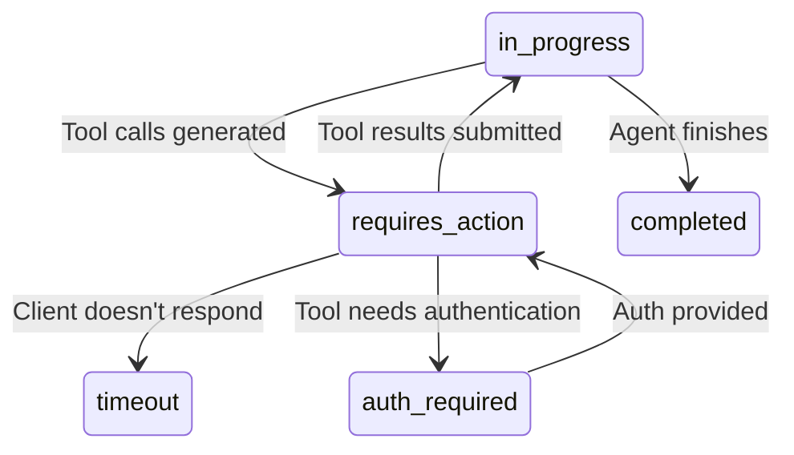

# Tool Execution Specification

**Version**: 1.0

## Overview

This specification defines tool call flow, execution patterns, result handling, error recovery, and retry behavior for the Agent Runtime API.

**Key Concepts:**
- **Tool Definition**: Describes what the tool does and its parameters (JSON Schema)
- **Tool Call**: Agent's request to execute a tool
- **Tool Result**: Output from tool execution
- **Tool Lifecycle Hooks**: Before/after execution guardrails

## Run Status Enum

The `RunStatus` enum defines the lifecycle states of a run execution. Tool execution affects several of these states:

| Status | Description | Tool Execution Relevance |
|--------|-------------|--------------------------|
| `queued` | Run is queued and waiting to start | Initial state before tool calls |
| `in_progress` | Run is currently executing | Agent is processing or generating tool calls |
| `requires_action` | Run is waiting for tool execution results | **Key state**: Agent has requested tool calls |
| `input_required` | Run is waiting for human input (HITL) | May occur if tool execution needs user clarification |
| `auth_required` | Run is waiting for authentication/authorization | Tool requires OAuth2 scopes |
| `cancelling` | User requested cancellation, run is stopping | Transitional state |
| `cancelled` | Run was cancelled by user before completion | Final state |
| `failed` | Run encountered an error | Tool execution error can cause this |
| `completed` | Run finished successfully | Tools executed successfully |
| `incomplete` | Run stopped before completion | May occur if tools timeout |
| `timeout` | Run exceeded time limit | Tool execution took too long |

**Source**: See `RunStatus` enum in `typespec/execution.tsp`

## Tool Call Flow

### Standard Flow

```
1. Agent Generates Tool Call
   Status: in_progress → requires_action
   Message: { type: "functionCall", callId: "call_1", name: "search", arguments: {...} }

2. Client Receives Tool Call
   GET /runs/{runId} or streaming update
   Extract tool call from message contents

3. Client Executes Tool
   Client-side execution (NOT server-side)
   Can be local function or external API call

4. Client Submits Tool Result
   POST /runs/{runId}/submit_tool_outputs
   { tool_outputs: [{ callId: "call_1", result: "..." }] }

5. Run Resumes
   Status transitions: requires_action → in_progress
   Agent processes tool result

6. Agent Generates Final Response
   Status transitions: in_progress → completed
   Message: { type: "text", text: "Based on the search results..." }
```

### Sequence Diagram

```
Client                Server                 Agent/LLM
   |                     |                       |
   | POST /runs          |                       |
   |-------------------->|                       |
   |                     | Generate response     |
   |                     |---------------------->|
   |                     |                       |
   |                     |    Tool call needed   |
   |                     |<----------------------|
   | Status: requires_   |                       |
   | action, FunctionCall|                       |
   |<--------------------|                       |
   |                     |                       |
   | Execute tool        |                       |
   | (client-side)       |                       |
   |                     |                       |
   | POST /runs/{runId}/ |                       |
   | submit_tool_outputs |                       |
   |-------------------->|                       |
   |                     | Resume with result    |
   |                     |---------------------->|
   |                     |                       |
   |                     |    Final response     |
   |                     |<----------------------|
   | Status: completed   |                       |
   |<--------------------|                       |
```

## Tool Definition

### TypeSpec Model

**Source**: See `AITool` model in `typespec/tools.tsp`

```typescript
model AITool {
  name: string;                        // Tool identifier
  description: string;                 // What the tool does
  parameters?: JSONSchema;             // Input schema (JSON Schema Draft 7)
  returnType?: JSONSchema;             // Output schema
  strict?: boolean;                    // Strict schema enforcement
  scopes?: Scopes;                     // Required OAuth2 scopes
  lifecycleHooks?: ToolLifecycleHooks; // Guardrails
  metadata?: Record<unknown>;          // Custom metadata
}
```

### JSON Schema Parameters

**Requirements:**

1. **Draft 7 Compliance**: Use JSON Schema Draft 7
2. **Type Specification**: Always specify `type` field
3. **Required Fields**: List in `required` array
4. **Descriptions**: Provide descriptions for all fields

**Example:**
```json
{
  "name": "search_web",
  "description": "Search the web for information",
  "parameters": {
    "type": "object",
    "properties": {
      "query": {
        "type": "string",
        "description": "Search query"
      },
      "limit": {
        "type": "integer",
        "description": "Maximum results",
        "default": 10
      }
    },
    "required": ["query"]
  }
}
```

## Tool Call Content

### FunctionCallContent

**TypeSpec**: See `FunctionCallContent` model in `typespec/messages.tsp`

```typescript
model FunctionCallContent {
  type: "functionCall";
  callId: string;                      // Unique call identifier
  name: string;                        // Tool name
  arguments?: string | Record<unknown>; // JSON string or object
  // Inherits from AIContentBase: audience?, encryption?, additionalProperties?
}
```

**Arguments Format:**

- **String**: JSON-encoded arguments (provider-native format)
  ```json
  { "arguments": "{\"query\": \"weather in Paris\", \"limit\": 5}" }
  ```

- **Object**: Parsed arguments (structured format)
  ```json
  { "arguments": { "query": "weather in Paris", "limit": 5 } }
  ```

**Requirements:**

Servers MUST:

1. **Generate Unique callId**: Use GUID or provider call ID
2. **Accept Both Formats**: Support string and object arguments
3. **Preserve Format**: Return arguments in same format as received from provider

## Tool Result Content

### FunctionResultContent

**TypeSpec**: See `FunctionResultContent` model in `typespec/messages.tsp`

```typescript
model FunctionResultContent {
  type: "functionResult";
  callId: string;                      // Matches FunctionCallContent.callId
  name: string;                        // Tool name
  result?: string | AIContent[];       // Result data (can be multi-modal)
  exception?: ErrorContent;            // Error if execution failed
  // Inherits from AIContentBase: audience?, encryption?, additionalProperties?
}
```

**Result Format:**

- **String**: Simple text result
  ```json
  { "result": "The weather in Paris is 18°C, partly cloudy" }
  ```

- **AIContent[]**: Multi-modal result
  ```json
  {
    "result": [
      { "kind": "image", "uri": "https://..." },
      { "kind": "text", "text": "Chart showing..." }
    ]
  }
  ```

**Error Handling:**

If tool execution fails, use `exception` field:
```json
{
  "kind": "functionResult",
  "callId": "call_1",
  "name": "search_web",
  "exception": {
    "type": "error",
    "code": "RATE_LIMIT_EXCEEDED",
    "message": "API rate limit exceeded"
  }
}
```

## Tool Execution Patterns

### Client-Side Execution (Default)

**Responsibility**: Client executes tools

**Flow:**
1. Server returns tool call
2. Client executes tool (local function or API call)
3. Client submits result
4. Server resumes run

**Advantages:**
- Client controls tool implementation
- Can use local resources
- No server-side tool registry needed

**Use Cases:**
- Custom business logic
- Local file access
- Client-specific APIs

### Server-Side Execution (Optional)

**Responsibility**: Server executes tools

**Flow:**
1. Server receives tool call from LLM
2. Server executes tool directly
3. Server submits result to LLM
4. Server continues run (no client interaction)

**Advantages:**
- Simpler client (no tool implementation)
- Faster execution (no round-trip)
- Centralized tool management

**Use Cases:**
- Common tools (web search, calculator)
- Server-side APIs
- Stateless tools

**Requirements:**

Servers implementing server-side execution MUST:

1. **Tool Registry**: Maintain tool definitions
2. **Execution Sandbox**: Isolate tool execution
3. **Timeout Handling**: Enforce execution timeouts
4. **Error Handling**: Catch and format tool errors

## Submit Tool Outputs

### API

**Endpoint:**
```http
POST /runs/{runId}/submit_tool_outputs
```

**Request:**
```json
{
  "tool_outputs": [
    {
      "callId": "call_1",
      "result": "The weather in Paris is 18°C"
    },
    {
      "callId": "call_2",
      "result": [
        { "kind": "image", "uri": "https://..." },
        { "kind": "text", "text": "Chart showing..." }
      ]
    }
  ]
}
```

**Response:**
```json
{
  "runId": "run_123",
  "status": "in_progress",
  "output": [
    { "kind": "functionResult", "callId": "call_1", ... },
    { "kind": "functionResult", "callId": "call_2", ... }
  ]
}
```

### Requirements

Servers MUST:

1. **Validate callId**: Ensure callId matches pending tool call
2. **Validate Status**: Only accept when status is `requires_action`
3. **Match All Calls**: Require results for ALL pending tool calls
4. **Resume Execution**: Transition status to `in_progress` after submission
5. **Atomic Update**: Update all tool results atomically

Servers SHOULD:

1. **Timeout Pending**: Transition to `failed` if no results submitted within timeout
2. **Deduplicate**: Ignore duplicate submissions for same callId

## Parallel Tool Calling

### Multiple Tool Calls

Some providers (OpenAI) support multiple tool calls in single turn:

```json
{
  "type": "assistant",
  "contents": [
    { "kind": "functionCall", "callId": "call_1", "name": "search", ... },
    { "kind": "functionCall", "callId": "call_2", "name": "translate", ... },
    { "kind": "functionCall", "callId": "call_3", "name": "summarize", ... }
  ]
}
```

**Requirements:**

Clients MUST:

1. **Execute All Tools**: Execute all tool calls (in parallel if possible)
2. **Submit All Results**: Provide results for all calls in single submission
3. **Match Order**: Results can be in any order (matched by callId)

**Example Submission:**
```json
POST /runs/{runId}/submit_tool_outputs
{
  "tool_outputs": [
    { "callId": "call_1", "result": "Search results..." },
    { "callId": "call_2", "result": "Translation..." },
    { "callId": "call_3", "result": "Summary..." }
  ]
}
```

### Execution Strategies

**Parallel Execution** (preferred):
```python
async def execute_tools(tool_calls):
    tasks = [execute_tool(call) for call in tool_calls]
    return await asyncio.gather(*tasks)
```

**Sequential Execution** (fallback):
```python
def execute_tools(tool_calls):
    results = []
    for call in tool_calls:
        result = execute_tool(call)
        results.append(result)
    return results
```

## Tool Lifecycle Hooks

### Guardrails

**TypeSpec**: See `ToolLifecycleHooks` model in `typespec/tools.tsp`

```typescript
model ToolLifecycleHooks {
  before_execute?: GuardrailDefinition[];  // Pre-execution validation
  after_execute?: GuardrailDefinition[];   // Post-execution validation
  on_error?: GuardrailDefinition[];        // Error handling
}
```

### Hook Execution

**Before Execute:**
- Validate tool inputs
- Check permissions/scopes
- Rate limiting
- **Action**: Block execution if validation fails

**After Execute:**
- Validate tool outputs
- Content moderation
- Compliance checks
- **Action**: Filter/redact content if validation fails

**On Error:**
- Log error details
- Notify monitoring
- Retry logic
- **Action**: Transform error message

### Guardrail Results

**TypeSpec**: See `GuardrailResult` model in `typespec/agents.tsp`

```typescript
model GuardrailResult {
  name: string;                    // Guardrail name
  hook: string;                    // Lifecycle hook (before_execute, after_execute, on_error)
  action: string;                  // Action taken (allow, block, redact)
  reason?: string;                 // Why action was taken
  tripwireTriggered?: boolean;     // Critical violation flag
  metadata?: Record<unknown>;      // Additional context
}
```

**Example:**
```json
{
  "name": "content_filter",
  "hook": "after_execute",
  "action": "redact",
  "reason": "PII detected in tool output",
  "tripwireTriggered": false,
  "metadata": {
    "redacted_fields": ["ssn", "email"]
  }
}
```

## Hook Integration with Tool Execution

### Overview

Hooks integrate with tool execution to enable event-driven interception at tool call and result points. Hooks evaluate **synchronously** before tool execution and after tool completion, allowing blocking, modification, or observation of tool operations.

**Key Concepts:**
- **Tool Call Hooks**: Evaluate before tool execution (tool.called event)
- **Tool Result Hooks**: Evaluate after tool execution (tool.result event)
- **Blocking Behavior**: Hooks can prevent tool execution or discard results
- **Content Modification**: Hooks can modify tool parameters or redact results
- **Security Enforcement**: Whitelist/blacklist tools, validate parameters

**Related Specifications:**
- [Hooks Specification](./hooks.md) - Hook types, conditions, responses
- [Run Lifecycle](./run-lifecycle.md) - State transitions with hooks
- [Streaming](./streaming.md) - Hook evaluation timing

### Tool Call Hooks (tool.called)

**Evaluation Point**: Before tool execution

**Event**: `tool.called` emitted when agent requests tool call

**Hook Actions:**

1. **Block**: Prevent tool execution, fail run
   ```json
   {
     "kind": "block",
     "condition": {
       "kind": "content",
       "patterns": ["rm -rf", "DROP TABLE", "DELETE FROM"]
     },
     "eventTypes": ["tool.called"]
   }
   ```

2. **Modify**: Change tool parameters before execution
   ```json
   {
     "kind": "modify",
     "condition": {
       "kind": "always"
     },
     "eventTypes": ["tool.called"],
     "action": {
       "kind": "modify",
       "content": {
         "arguments": {
           "limit": 10  // Force pagination limit
         }
       }
     }
   }
   ```

3. **Allow**: Permit tool execution (no changes)

**Example - Blocking Dangerous Tool:**

```typescript
// Hook configuration
{
  "kind": "block",
  "condition": {
    "kind": "expression",
    "expression": "event.toolName == 'execute_command' && event.arguments.command.contains('rm')"
  },
  "eventTypes": ["tool.called"]
}

// Agent requests tool call
{
  "kind": "functionCall",
  "callId": "call_123",
  "name": "execute_command",
  "arguments": {
    "command": "rm -rf /data"
  }
}

// Hook blocks: Tool NOT executed, run fails
Run status: failed
Error: {
  "code": "hook_blocked",
  "message": "Tool call blocked by security policy",
  "details": {
    "hookId": "hook-prevent-destructive-commands",
    "eventType": "tool.called",
    "toolName": "execute_command"
  }
}
```

**Use Cases:**

1. **Security Policy Enforcement**:
   - Block file deletion commands
   - Block SQL DROP/DELETE statements
   - Prevent API calls to blacklisted domains

2. **Rate Limiting**:
   - Block excessive API calls (>10/minute)
   - Enforce cooldown periods between calls

3. **Parameter Validation**:
   - Validate SQL queries (prevent injection)
   - Validate file paths (prevent directory traversal)
   - Sanitize user inputs before tool execution

4. **Permission Checks**:
   - Verify user has permission to call tool
   - Check agent authorization for sensitive tools
   - Enforce role-based access control (RBAC)

**Source**: [Hooks Specification](./hooks.md) - HookActionResponse types

### Tool Result Hooks (tool.result)

**Evaluation Point**: After tool execution

**Event**: `tool.result` emitted when tool execution completes

**Hook Actions:**

1. **Block**: Discard tool result, fail run
   ```json
   {
     "kind": "block",
     "condition": {
       "kind": "content",
       "patterns": ["\\d{3}-\\d{2}-\\d{4}"]  // SSN pattern
     },
     "eventTypes": ["tool.result"]
   }
   ```

2. **Modify**: Redact sensitive data from result
   ```json
   {
     "kind": "modify",
     "condition": {
       "kind": "content",
       "patterns": ["\\b[A-Z0-9._%+-]+@[A-Z0-9.-]+\\.[A-Z]{2,}\\b"]  // Email pattern
     },
     "eventTypes": ["tool.result"],
     "action": {
       "kind": "modify",
       "content": {
         "result": "[REDACTED_EMAIL]"
       }
     }
   }
   ```

3. **Allow**: Use tool result as-is

**Example - Redacting PII from Tool Result:**

```typescript
// Hook configuration (PII redaction)
{
  "kind": "modify",
  "condition": {
    "kind": "content",
    "patterns": ["\\d{3}-\\d{2}-\\d{4}", "\\b[A-Z0-9._%+-]+@[A-Z0-9.-]+\\.[A-Z]{2,}\\b"]
  },
  "eventTypes": ["tool.result"]
}

// Tool execution result (contains PII)
{
  "kind": "functionResult",
  "callId": "call_123",
  "name": "lookup_customer",
  "result": {
    "name": "John Doe",
    "ssn": "123-45-6789",
    "email": "john.doe@example.com",
    "balance": "$1,250.00"
  }
}

// Hook modifies: PII redacted
{
  "kind": "functionResult",
  "callId": "call_123",
  "name": "lookup_customer",
  "result": {
    "name": "John Doe",
    "ssn": "[REDACTED]",
    "email": "[REDACTED]",
    "balance": "$1,250.00"
  },
  "hookModified": true  // Indicates hook modification
}

// Agent receives redacted result, continues with protected data
```

**Use Cases:**

1. **PII Redaction**:
   - Redact SSNs, credit cards, emails from database queries
   - Remove sensitive fields before sending to agent
   - Compliance with GDPR, HIPAA, PCI-DSS

2. **Content Filtering**:
   - Remove offensive content from web scraping results
   - Filter inappropriate images from search results
   - Block malicious URLs from tool output

3. **Data Sanitization**:
   - Remove debug information from error messages
   - Strip internal IDs before exposing to agent
   - Normalize data formats

4. **Compliance Logging**:
   - Log all tool results containing sensitive keywords
   - Audit trail for regulatory compliance
   - Alert on policy violations

**Source**: [Hooks Specification](./hooks.md) - ModifyHook

### State Transition Impact

Tool execution with hooks affects run state transitions:

**Normal Flow (No Hooks):**
```
in_progress → requires_action (tool.called) → [tool execution] → tool.result → in_progress
```

**Blocked at tool.called:**
```
in_progress → requires_action (tool.called)
           └─ Hook evaluates tool.called
              └─ BlockResponse returned
                 └─ Run status: failed
```

**Client View:**
- Never sees tool execution (blocked before execution)
- Sees `run.failed` with `error.code = "hook_blocked"`
- No tool result emitted

**Blocked at tool.result:**
```
in_progress → requires_action (tool.called) → [tool execution] → tool.result
                                                               └─ Hook evaluates tool.result
                                                                  └─ BlockResponse returned
                                                                     └─ Run status: failed
```

**Client View:**
- Sees `tool.called` event (tool execution started)
- Never sees `tool.result` (blocked after execution)
- Sees `run.failed` with `error.code = "hook_blocked"`
- Tool was executed but result discarded

**Modified at tool.result:**
```
in_progress → requires_action (tool.called) → [tool execution] → tool.result (original: sensitive data)
                                                               └─ Hook evaluates tool.result
                                                                  └─ ModifyResponse returned (redact PII)
                                                                     └─ tool.result emitted (modified: [REDACTED])
```

**Client View:**
- Sees `tool.called` event
- Sees `tool.result` with `hookModified: true` and redacted content
- Run continues normally with modified result

**Source**: [Run Lifecycle](./run-lifecycle.md) - Hook Evaluation Points

### Hook Configuration for Tool Security

**Example - Comprehensive Tool Security Policy:**

```typescript
// Hook 1: Block dangerous system commands
{
  "kind": "block",
  "condition": {
    "kind": "expression",
    "expression": "event.toolName == 'execute_command' && (event.arguments.command.contains('rm -rf') || event.arguments.command.contains('DROP TABLE'))"
  },
  "eventTypes": ["tool.called"]
}

// Hook 2: Rate limit API calls
{
  "kind": "block",
  "condition": {
    "kind": "expression",
    "expression": "event.toolName == 'call_external_api' && state.apiCallCount > 10"
  },
  "eventTypes": ["tool.called"]
}

// Hook 3: Redact PII from database queries
{
  "kind": "modify",
  "condition": {
    "kind": "content",
    "patterns": ["\\d{3}-\\d{2}-\\d{4}", "\\d{16}"]  // SSN, credit card
  },
  "eventTypes": ["tool.result"]
}

// Hook 4: Log all tool calls to sensitive systems
{
  "kind": "telemetry",
  "condition": {
    "kind": "expression",
    "expression": "event.toolName == 'query_production_db'"
  },
  "eventTypes": ["tool.called", "tool.result"],
  "destination": "audit_log"
}
```

**Performance Considerations:**

| Hook Type | Evaluation Time | Impact on Tool Execution |
|-----------|----------------|-------------------------|
| BlockHook (regex) | 1-5ms | Low (quick validation) |
| BlockHook (expression) | 5-20ms | Moderate (expression evaluation) |
| ModifyHook (regex) | 1-10ms | Low (regex replacement) |
| RemoteHook (WebSocket) | 10-100ms | Moderate (network latency) |
| RemoteHook (HTTP) | 50-500ms | High (HTTP overhead) |

**Optimization Tips:**

1. **Use Local Hooks When Possible**: BlockHook and ModifyHook are faster than RemoteHook
2. **Cache Remote Hook Results**: Cache evaluation results for identical tool calls (short TTL)
3. **Optimize Regex Patterns**: Use efficient regex patterns to minimize evaluation time
4. **Batch Telemetry**: Use TelemetryHook (non-blocking) for logging instead of blocking hooks

**Source**: [Hooks Specification](./hooks.md) - Performance Considerations

## Tool Execution and Run Lifecycle

### Overview

Tool execution is tightly integrated with the run lifecycle, causing state transitions between `in_progress`, `requires_action`, and potentially `auth_required`. This section explains the complete flow.

**Key Concepts:**
- **requires_action State**: Run paused, waiting for tool results
- **Client Responsibilities**: Executing tools and submitting results
- **Multiple Tool Cycles**: Runs can have multiple requires_action phases
- **Timeout Behavior**: Runs timeout if client doesn't respond

**Related Specifications:**
- [Run Lifecycle](./run-lifecycle.md) - Complete state machine
- [Authentication](./authentication.md) - Tool authentication flow

### State Transitions with Tool Execution

**Complete Flow:**

```typescript
// Phase 1: Agent generates tool calls
t=0ms:    Run status: in_progress
t=100ms:  Agent generates tool calls
t=105ms:  Hooks evaluate tool.called events
t=110ms:  Run status: requires_action
t=115ms:  Emit: tool.called events to client

// Phase 2: Client executes tools
t=200ms:  Client receives tool.called events
t=300ms:  Client executes tools (external API calls, database queries, etc.)
t=500ms:  Client submits tool results: POST /runs/{runId}/submit_tool_outputs

// Phase 3: Run resumes with tool results
t=510ms:  Hooks evaluate tool.result events
t=515ms:  Run status: in_progress
t=520ms:  Agent processes tool results
t=600ms:  Agent generates response
t=610ms:  Run status: completed
```

**State Diagram:**



**Source**: [Run Lifecycle](./run-lifecycle.md) - State machine

#### Tool Call Sequence with Hook Integration

```
Complete Tool Execution Flow - Actors and Message Flow
═══════════════════════════════════════════════════════════════════════════════

    Client          Server          Agent        Hook System      External API
      │               │               │               │                 │
      │ POST /runs    │               │               │                 │
      ├──────────────>│               │               │                 │
      │               │               │               │                 │
      │ SSE Stream    │               │               │                 │
      │ (connected)   │               │               │                 │
      │<──────────────┤               │               │                 │
      │               │               │               │                 │
      │               │ Start Run     │               │                 │
      │               ├──────────────>│               │                 │
      │               │               │               │                 │
      │               │               │ Generate      │                 │
      │               │               │ Tool Call     │                 │
      │               │               │               │                 │
      │               │ Tool Call     │               │                 │
      │               │ Generated     │               │                 │
      │               │<──────────────┤               │                 │
      │               │               │               │                 │
      │               │ Evaluate tool.called          │                 │
      │               ├──────────────────────────────>│                 │
      │               │               │               │                 │
      │               │               │          Check Condition        │
      │               │               │          (pattern match,        │
      │               │               │           expression eval)      │
      │               │               │               │                 │
      │               │               │               ├─ Condition Met? │
      │               │               │               │                 │
      │               │               │               ├─ Remote Hook?   │
      │               │               │               │  (call endpoint) │
      │               │               │               │─────────────────>
      │               │               │               │                 │
      │               │               │               │ Hook Response   │
      │               │               │               │<─────────────────
      │               │               │               │                 │
      │               │ Hook Result   │               │                 │
      │               │ (allow/block/modify)          │                 │
      │               │<──────────────────────────────┤                 │
      │               │               │               │                 │
      │               │ ┌─ If BLOCKED: run.failed ───────────┐         │
      │               │ │  Exit early, return 403            │         │
      │               │ └────────────────────────────────────┘         │
      │               │               │               │                 │
      │               │ ┌─ If ALLOWED or MODIFIED ──────────┐          │
      │               │ │  status: requires_action          │          │
      │               │ └───────────────────────────────────┘          │
      │               │               │               │                 │
      │ SSE: tool.called               │               │                 │
      │ { callId,     │               │               │                 │
      │   name, args} │               │               │                 │
      │<──────────────┤               │               │                 │
      │               │               │               │                 │
      │ Execute Tool  │               │               │                 │
      │ Locally or    │               │               │                 │
      │ Call External ────────────────────────────────────────────────>│
      │               │               │               │                 │
      │               │               │               │   Execute Tool  │
      │               │               │               │   (DB, API, etc)│
      │               │               │               │                 │
      │               │               │               │   Tool Result   │
      │<────────────────────────────────────────────────────────────────
      │               │               │               │                 │
      │ POST /runs/{id}/submit_tool_outputs          │                 │
      │ { results: [{│               │               │                 │
      │   callId,     │               │               │                 │
      │   result}]}   │               │               │                 │
      ├──────────────>│               │               │                 │
      │               │               │               │                 │
      │               │ Evaluate tool.result          │                 │
      │               ├──────────────────────────────>│                 │
      │               │               │               │                 │
      │               │               │          Check for PII          │
      │               │               │          (SSN, email, etc)      │
      │               │               │               │                 │
      │               │               │               ├─ PII Found?     │
      │               │               │               │  Redact!        │
      │               │               │               │                 │
      │               │ Hook Result   │               │                 │
      │               │ (modify: redact PII)          │                 │
      │               │<──────────────────────────────┤                 │
      │               │               │               │                 │
      │               │ Resume Run    │               │                 │
      │               │ (with results)│               │                 │
      │               ├──────────────>│               │                 │
      │               │               │               │                 │
      │               │               │ Process       │                 │
      │               │               │ Results       │                 │
      │               │               │ (redacted)    │                 │
      │               │               │               │                 │
      │               │               │ Generate      │                 │
      │               │               │ Response      │                 │
      │               │               │               │                 │
      │               │ Response      │               │                 │
      │               │ Generated     │               │                 │
      │               │<──────────────┤               │                 │
      │               │               │               │                 │
      │ SSE: tool.result               │               │                 │
      │ { callId,     │               │               │                 │
      │   result,     │               │               │                 │
      │   hookModified}                │               │                 │
      │<──────────────┤               │               │                 │
      │               │               │               │                 │
      │ SSE: message.completed         │               │                 │
      │ (agent response)               │               │                 │
      │<──────────────┤               │               │                 │
      │               │               │               │                 │
      │ SSE: run.completed             │               │                 │
      │ { status:     │               │               │                 │
      │   "completed",│               │               │                 │
      │   output: [...]}              │               │                 │
      │<──────────────┤               │               │                 │
      │               │               │               │                 │

═══════════════════════════════════════════════════════════════════════════════

Legend:
  ──────>  = Synchronous request/response
  ═══════> = Asynchronous event (SSE)
  ┌─ ─┐    = Conditional logic/decision point

Key Observations:
  1. Hook evaluation is synchronous (blocks tool.called emission)
  2. Client executes tools externally (not server-side)
  3. Tool results can be modified by hooks (PII redaction)
  4. hookModified flag indicates content was filtered
  5. Multiple tool cycles possible (not shown - run loops back to "Generate Tool Call")
```

### Client Responsibilities

**1. Monitor for Tool Calls:**

```typescript
const eventSource = new EventSource('/runs/run-123/stream');

eventSource.addEventListener('tool.called', (e) => {
  const data = JSON.parse(e.data);

  data.toolCalls.forEach(async (toolCall) => {
    // Execute tool
    const result = await executeToolLocally(toolCall);

    // Store result for batch submission
    toolResults.push({
      callId: toolCall.callId,
      result: result
    });
  });
});
```

**2. Execute Tools:**

Tools can be executed:
- **Client-Side**: Client code executes tool (e.g., file operations, local calculations)
- **Server-Side**: Client proxies to server tool executor (e.g., database queries, external APIs)
- **Hybrid**: Client orchestrates, server validates

**3. Submit Tool Results:**

```http
POST /runs/run-123/submit_tool_outputs
Content-Type: application/json

{
  "results": [
    {
      "callId": "call_1",
      "result": {"temperature": 72, "humidity": 45}
    },
    {
      "callId": "call_2",
      "result": "Search completed: 127 results found"
    }
  ]
}

Response: 200 OK
{
  "runId": "run-123",
  "status": "in_progress",
  "message": "Tool results accepted, run resumed"
}
```

**Error Submission:**

If tool execution fails:

```http
POST /runs/run-123/submit_tool_outputs
{
  "results": [
    {
      "callId": "call_1",
      "exception": {
        "type": "error",
        "code": "NETWORK_ERROR",
        "message": "Failed to connect to external API"
      }
    }
  ]
}
```

**Source**: [Submit Tool Outputs](#submit-tool-outputs) section above

### Multiple Tool Cycles

Runs can have multiple `requires_action` phases:

**Example:**

```typescript
// Cycle 1: Initial tool calls
t=0ms:    Run starts
t=100ms:  Agent calls search_web → requires_action
t=200ms:  Client submits search results → in_progress
t=300ms:  Agent processes results

// Cycle 2: Follow-up tool calls based on first results
t=400ms:  Agent calls lookup_details → requires_action (again!)
t=500ms:  Client submits detail results → in_progress
t=600ms:  Agent generates final response → completed
```

**Characteristics:**
- Unlimited requires_action cycles (until agent completes or timeout)
- Each cycle independent (different tools, different parameters)
- Client must handle multiple tool call batches

**Use Case**: Multi-step research

```typescript
1. Agent calls search_web("latest AI research")
2. Client returns 10 results
3. Agent analyzes results, decides to get details
4. Agent calls fetch_paper_details(paper_id_1, paper_id_2, paper_id_3)
5. Client returns paper abstracts
6. Agent synthesizes information, completes
```

**Source**: [Run Lifecycle](./run-lifecycle.md) - requires_action state

### Timeout Behavior

**Default Timeout**: 10 minutes

If client doesn't submit tool results within timeout:

```
Run status: requires_action (t=0)
... 10 minutes pass ...
Run status: timeout (t=10min)
```

**Run Details:**

```json
{
  "runId": "run-123",
  "status": "timeout",
  "error": {
    "code": "tool_response_timeout",
    "message": "Client did not submit tool results within 10 minutes"
  },
  "lastActiveAt": "2026-02-06T10:00:00Z",
  "timeoutAt": "2026-02-06T10:10:00Z"
}
```

**Partial Output Preservation:**

Messages generated before tool call are preserved:

```json
{
  "runId": "run-123",
  "status": "timeout",
  "output": {
    "messageId": "msg_abc",
    "contents": [
      {
        "kind": "text",
        "text": "Let me search for that information..."
      }
    ]
  },
  "pendingToolCalls": [
    {
      "callId": "call_1",
      "name": "search_web",
      "arguments": {"query": "..."}
    }
  ]
}
```

**Client Handling:**

```typescript
eventSource.addEventListener('run.timeout', (e) => {
  const data = JSON.parse(e.data);

  // Show user partial output
  displayMessage(data.output);

  // Show timeout error
  showError("The operation timed out waiting for tool execution");

  // Option to retry
  if (confirm("Retry with same tools?")) {
    retryRun(data.runId, data.pendingToolCalls);
  }
});
```

**Source**: [Run Lifecycle](./run-lifecycle.md) - Timeout state

## Tool Authentication and Connections

### Overview

Tools that access external systems often require authentication. The Agent Runtime API provides a Connection system to manage credentials for tools.

**Key Concepts:**
- **Connection Requirement**: Tools declare required connections
- **auth_required State**: Run pauses if connection missing
- **Connection Types**: OAuth2, API key, basic auth, custom
- **Connection Reuse**: Stored connections for repeated use

**Related Specifications:**
- [Authentication Specification](./authentication.md) - Connection types, OAuth2 flow
- [Run Lifecycle](./run-lifecycle.md) - auth_required state

### Connection Requirement

Tools declare connection requirements in definition:

```typescript
// Tool definition
{
  "name": "send_email",
  "description": "Send email via Gmail",
  "parameters": {...},
  "connection": {
    "provider": "gmail",
    "scope": ["https://www.googleapis.com/auth/gmail.send"]
  }
}

// Agent configuration
{
  "agentId": "agent_123",
  "tools": [
    {
      "name": "send_email",
      "connectionId": "conn_gmail_user1"  // Pre-configured connection
    }
  ]
}
```

**Connection Missing:**

If connection not configured, run enters `auth_required` state:

```typescript
// Run starts
POST /runs
{
  "agentId": "agent_123",
  "input": "Send email to john@example.com"
}

// Agent calls send_email tool
// Connection missing → auth_required
Response: 200 OK
{
  "runId": "run_456",
  "status": "auth_required",
  "requiredConnection": {
    "provider": "gmail",
    "scope": ["https://www.googleapis.com/auth/gmail.send"],
    "authUrl": "https://accounts.google.com/o/oauth2/v2/auth?client_id=..."
  }
}
```

**Source**: [Authentication Specification](./authentication.md) - Connection requirement

### Authentication Flow

**OAuth2 Flow (User Authorization):**

```typescript
// Step 1: Run enters auth_required
GET /runs/run-456
{
  "status": "auth_required",
  "requiredConnection": {
    "provider": "gmail",
    "scope": ["https://www.googleapis.com/auth/gmail.send"],
    "authUrl": "https://accounts.google.com/o/oauth2/v2/auth?..."
  }
}

// Step 2: Client redirects user to authUrl
window.location.href = authUrl;

// Step 3: User authorizes, redirected back with code
// Callback: https://yourapp.com/callback?code=AUTH_CODE

// Step 4: Client submits auth code
POST /runs/run-456/submit_auth
{
  "connection": {
    "kind": "oauth2",
    "provider": "gmail",
    "code": "AUTH_CODE",
    "redirectUri": "https://yourapp.com/callback"
  }
}

// Step 5: Server exchanges code for tokens, run resumes
Response: 200 OK
{
  "runId": "run-456",
  "status": "in_progress",
  "connectionId": "conn_gmail_user1"  // Connection stored for reuse
}
```

**API Key Flow (Direct Credential):**

```typescript
// Client provides API key directly
POST /runs/run-456/submit_auth
{
  "connection": {
    "kind": "apiKey",
    "provider": "openweather",
    "key": "your_api_key_here"
  }
}

Response: 200 OK
{
  "runId": "run-456",
  "status": "in_progress",
  "connectionId": "conn_openweather_user1"
}
```

**Source**: [Authentication Specification](./authentication.md) - OAuth2 flow

### Connection Types

**1. OAuth2 Connection:**

```typescript
{
  "kind": "oauth2",
  "provider": "github",
  "scope": ["repo", "user"],
  "accessToken": "gho_...",  // Server-managed, not exposed to client
  "refreshToken": "ghr_...",
  "expiresAt": "2026-02-07T10:00:00Z"
}
```

**Use Cases:**
- GitHub: Access repositories, create PRs
- Gmail: Send emails, read inbox
- Slack: Post messages, read channels
- Salesforce: Query CRM data

**2. API Key Connection:**

```typescript
{
  "kind": "apiKey",
  "provider": "openweather",
  "key": "your_api_key"  // Encrypted at rest
}
```

**Use Cases:**
- OpenWeather: Weather data
- Stripe: Payment processing
- SendGrid: Email sending
- Custom APIs: Internal services

**3. Basic Auth Connection:**

```typescript
{
  "kind": "basicAuth",
  "provider": "jenkins",
  "username": "admin",
  "password": "encrypted_password"
}
```

**Use Cases:**
- Jenkins: Trigger builds
- Internal APIs: Basic auth endpoints
- Legacy systems: HTTP basic authentication

**4. Custom Connection:**

```typescript
{
  "kind": "custom",
  "provider": "custom_service",
  "credentials": {
    "apiKey": "...",
    "secret": "...",
    "tenant": "..."
  }
}
```

**Use Cases:**
- Multi-tenant SaaS: Custom auth schemes
- Enterprise SSO: Custom token formats
- Proprietary APIs: Vendor-specific auth

**Source**: [Authentication Specification](./authentication.md) - Connection types

### Connection Reuse

**Stored Connections:**

After successful authentication, connections stored for reuse:

```typescript
// First run: auth_required → user authorizes → connection stored
POST /runs (run-1)
Status: auth_required → user authorizes → in_progress
Connection stored: conn_gmail_user1

// Second run: Same agent, same tool → connection reused
POST /runs (run-2)
Status: in_progress (no auth required!)
Uses: conn_gmail_user1
```

**Automatic Refresh:**

OAuth2 tokens automatically refreshed by the framework:

```typescript
// Access token expires
expiresAt: "2026-02-07T10:00:00Z"

// Tool call at 10:01:00 (1 minute after expiry)
// Server automatically refreshes using refresh token
// No user interaction needed
// Tool execution proceeds normally
```

**Revocation Handling:**

If user revokes authorization externally:

```typescript
// Tool call with revoked connection
Run transitions to: auth_required
Error: {
  "code": "connection_revoked",
  "message": "User revoked Gmail authorization",
  "connectionId": "conn_gmail_user1"
}

// Client must re-authorize
```

**Source**: [Authentication Specification](./authentication.md) - Connection lifecycle

## Error Handling

### Tool Execution Errors

**Common Error Codes:**

| Error Code | Description | Recovery |
|------------|-------------|----------|
| `TOOL_NOT_FOUND` | Tool name not recognized | Skip tool, continue |
| `INVALID_ARGUMENTS` | Arguments don't match schema | Retry with corrected args |
| `EXECUTION_TIMEOUT` | Tool took too long | Retry or skip |
| `PERMISSION_DENIED` | Missing required scopes | Request auth, retry |
| `RATE_LIMIT_EXCEEDED` | API rate limit hit | Wait and retry |
| `TOOL_EXECUTION_ERROR` | Tool threw exception | Log error, skip tool |

### Error Recovery Strategies

**1. Skip Tool** (continue without result):
```json
{
  "callId": "call_1",
  "exception": {
    "type": "error",
    "code": "TOOL_NOT_FOUND",
    "message": "Tool 'unknown_tool' not found"
  }
}
```
- Agent continues with error information
- May ask user for clarification

**2. Retry with Correction**:
- Client detects `INVALID_ARGUMENTS`
- Client corrects arguments
- Client resubmits tool call

**3. Request Authentication**:
- Tool requires OAuth2 scopes
- Client initiates auth flow
- Client retries after auth

**4. Fail Run**:
- Unrecoverable error
- Transition run to `failed` status
- Include error details in run.error

## Tool Scopes

### OAuth2 Permission Enforcement

**TypeSpec**: See `AITool.scopes` field in `typespec/tools.tsp`

```typescript
model AITool {
  scopes?: Scopes;  // OAuth2 scopes required for this tool
}
```

**Example:**
```json
{
  "name": "send_email",
  "description": "Send email via Microsoft Graph",
  "scopes": {
    "https://graph.microsoft.com/Mail.Send": "Send mail as the signed-in user"
  }
}
```

### Scope Validation Flow

```
1. Agent Generates Tool Call
   Tool: send_email
   Required scopes: ["Mail.Send"]

2. Server Validates Scopes
   Check if agent has required scopes
   AgentCard.scopes includes "Mail.Send"?

3. If Missing Scopes:
   Run status: in_progress → auth_required
   Return error: PERMISSION_DENIED

4. Client Requests Consent
   Show OAuth2 consent screen
   User grants "Mail.Send" permission

5. Client Submits Auth
   POST /runs/{runId}/submit_auth
   { connection: { type: "oauth2", scopes: ["Mail.Send"] } }

6. Run Resumes
   Run status: auth_required → in_progress
   Tool execution proceeds
```

## Validation Rules

### Tool Call Validation

Servers MUST reject tool calls if:

1. **Invalid Call ID**: Duplicate or empty `callId`
2. **Unknown Tool**: Tool name not in agent's tool list
3. **Invalid Arguments**: Arguments don't match JSON schema
4. **Missing Required**: Required arguments missing

### Tool Result Validation

Servers MUST reject tool results if:

1. **Invalid Call ID**: `callId` doesn't match pending tool call
2. **Incorrect Status**: Run not in `requires_action` status
3. **Incomplete**: Missing results for some tool calls
4. **Invalid Result**: Result doesn't match tool's returnType schema

## Performance Requirements

### Latency Targets

| Operation | Target | Maximum |
|-----------|--------|---------|
| Submit tool outputs | < 100ms | 500ms |
| Tool validation | < 50ms | 200ms |
| Parallel tool execution (client) | - | 30s |

### Resource Limits

Servers SHOULD:

1. **Max Parallel Tools**: Limit to 10 tool calls per turn
2. **Argument Size**: Limit to 100KB per tool call
3. **Result Size**: Limit to 1MB per tool result
4. **Execution Timeout**: Default 30s, configurable per tool

## Compliance

This specification aligns with:
- **TypeSpec**: `typespec/tools.tsp` (AITool, ToolLifecycleHooks)
- **TypeSpec**: `typespec/messages.tsp` (FunctionCallContent, FunctionResultContent)
- **API Reference**: `Docs/api-reference/tools.md` (tool definitions)
- **OpenAI Pattern**: Tool calling flow
- **MAF Pattern**: AIFunction model

## See Also

- [Run Lifecycle](./run-lifecycle.md) - Run state transitions
- [Authentication](./authentication.md) - OAuth2 scope enforcement
- [Streaming](./streaming.md) - Streaming tool results
- [Error Handling](./error-handling.md) - Tool error codes
